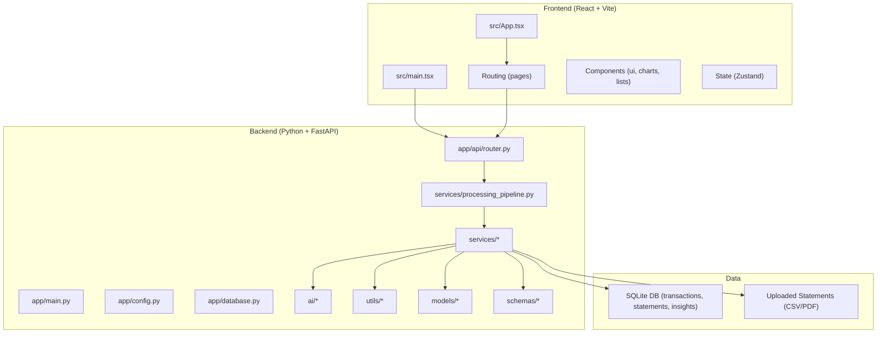
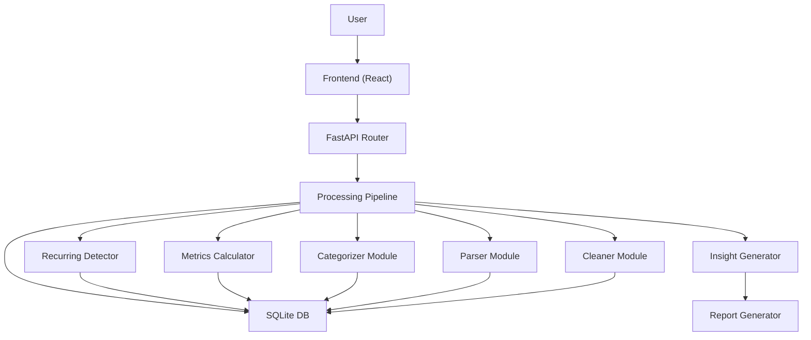
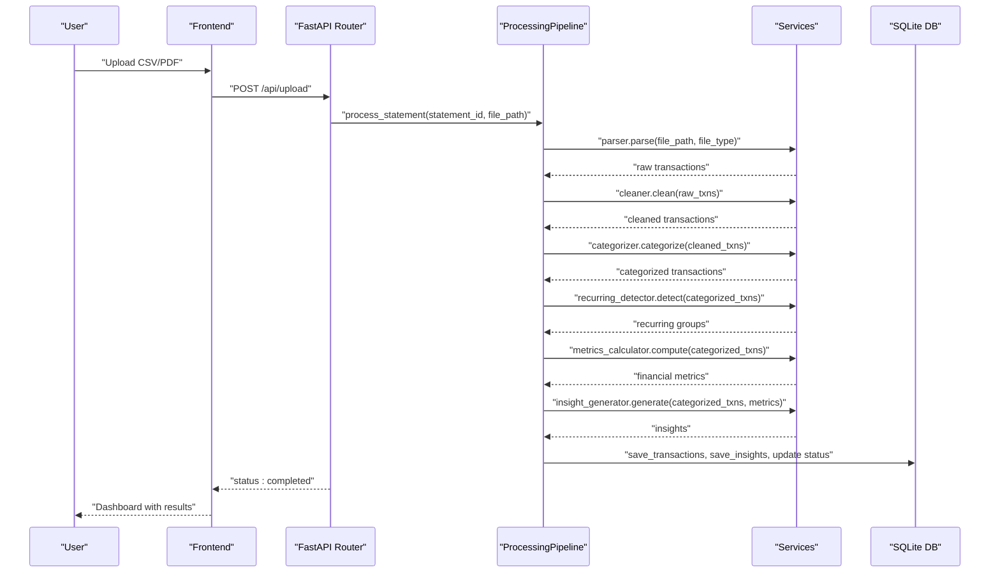
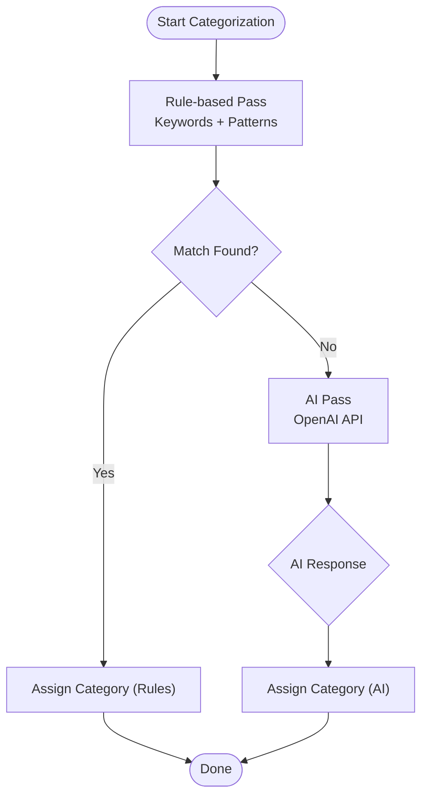
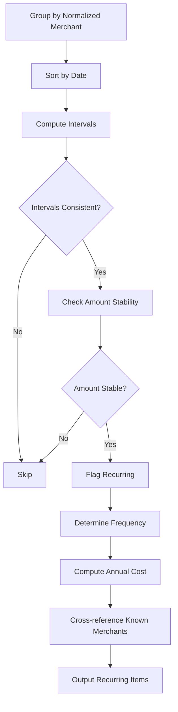
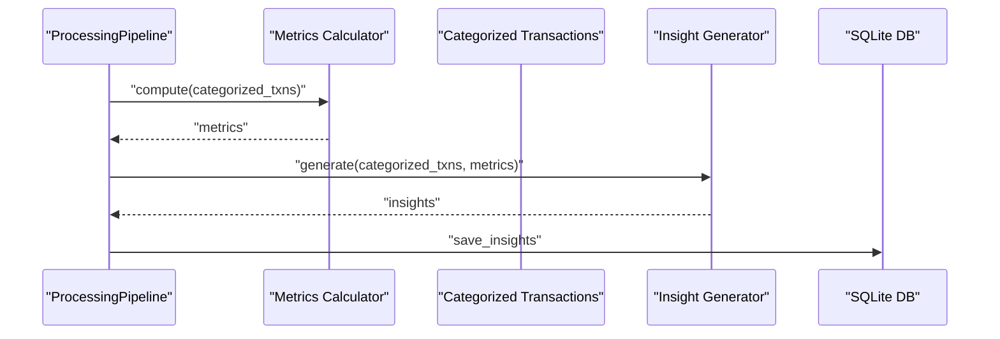
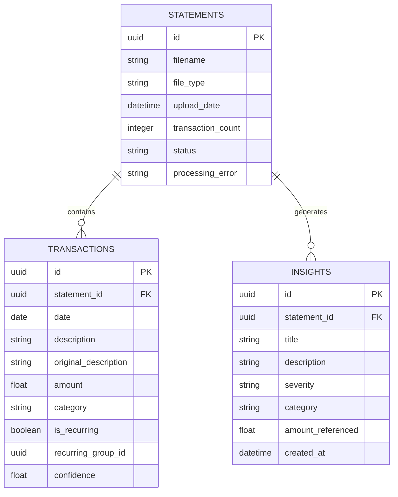
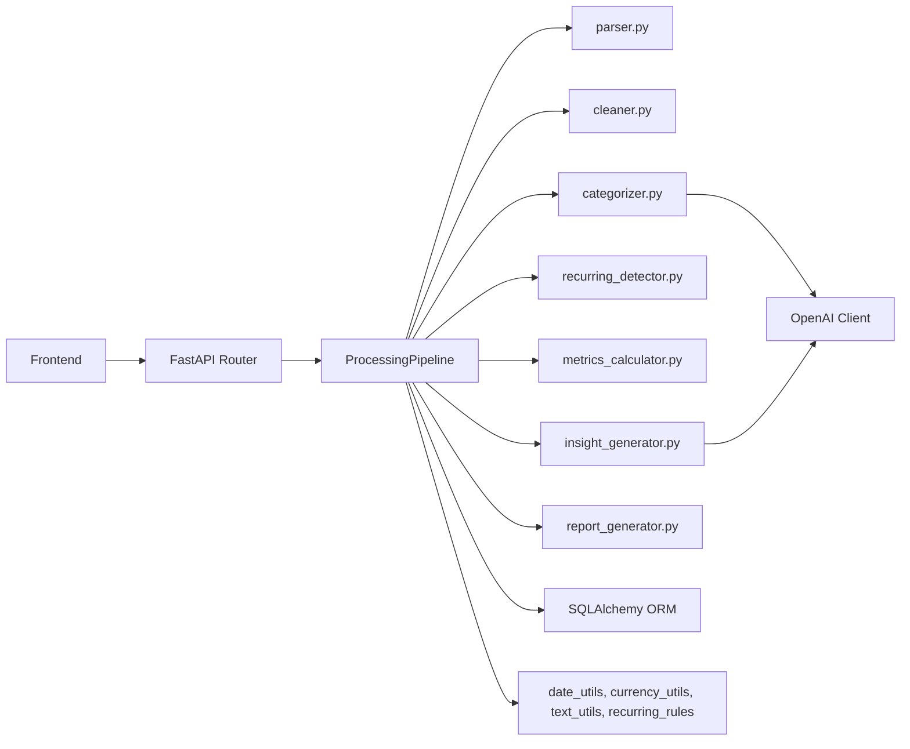

# Architecture Design

<cite>
**Referenced Files in This Document**
- [context.md](file://context.md)
- [architecture.md](file://architecture.md)
- [problemStatement.txt](file://problemStatement.txt)
</cite>

## Table of Contents
1. [Introduction](#introduction)
2. [Project Structure](#project-structure)
3. [Core Components](#core-components)
4. [Architecture Overview](#architecture-overview)
5. [Detailed Component Analysis](#detailed-component-analysis)
6. [Dependency Analysis](#dependency-analysis)
7. [Performance Considerations](#performance-considerations)
8. [Troubleshooting Guide](#troubleshooting-guide)
9. [Conclusion](#conclusion)
10. [Appendices](#appendices)

## Introduction
This document presents the end-to-end architecture of RupeeRadar, an AI-powered personal finance assistant that transforms raw bank statement data into actionable insights. The system follows a client-server design with a React frontend and a Python FastAPI backend. The backend orchestrates a sequential processing pipeline that parses, cleans, categorizes, detects recurring payments, computes financial metrics, generates insights, and persists results for presentation.

Key goals:
- Provide a working prototype that answers user questions about spending categories, total spend, recurring subscriptions, biggest transactions, and personalized insights.
- Demonstrate robust handling of messy transaction descriptions with hybrid categorization (rules + AI).
- Maintain privacy-conscious processing by avoiding persistent storage of raw statements and minimal data exposure to external APIs.

**Section sources**
- [context.md:1-80](file://context.md#L1-L80)
- [problemStatement.txt:1-43](file://problemStatement.txt#L1-L43)

## Project Structure
The repository organizes the system into frontend and backend layers, with shared concerns and data assets. The directory structure highlights separation of concerns across parsing, cleaning, categorization, recurring detection, metrics computation, insight generation, and report creation.

**Diagram sources**
- [architecture.md:73-186](file://architecture.md#L73-L186)

**Section sources**
- [architecture.md:73-186](file://architecture.md#L73-L186)

## Core Components
This section outlines the primary components and their responsibilities across the ingestion, processing, and presentation layers.

- Frontend (React + Vite)
  - Pages: Upload, Dashboard, Insights, Report.
  - Components: File upload, charts, metrics cards, recurring list, top transactions, report download.
  - State management: Zustand store for statement lifecycle and fetched data.
  - Utilities: Currency and date formatting helpers.

- Backend (Python + FastAPI)
  - API Layer: Upload, Transactions, Categories, Recurring, Metrics, Insights, Report endpoints.
  - Processing Pipeline: Orchestrates parse → clean → categorize → recurring → metrics → insights.
  - Services: Parser, Cleaner, Categorizer, Recurring Detector, Metrics Calculator, Insight Generator, Report Generator.
  - AI: OpenAI client, prompts, structured chains for categorization and insights.
  - Utilities: Date, currency, text, and recurring rules helpers.
  - Models and Schemas: SQLAlchemy ORM models and Pydantic schemas for persistence and API contracts.
  - Data: Sample statements and keyword/category/recurring merchant configurations.

- Database and Storage
  - SQLite via SQLAlchemy for transactions, statements, and insights.
  - File storage for uploaded statements during processing.

**Section sources**
- [architecture.md:125-186](file://architecture.md#L125-L186)
- [architecture.md:407-483](file://architecture.md#L407-L483)

## Architecture Overview
The system employs a layered architecture with clear separation between presentation, API orchestration, processing services, AI integration, and persistence. The processing pipeline enforces a sequential flow with explicit stage boundaries and deterministic outputs.

**Diagram sources**
- [architecture.md:3-47](file://architecture.md#L3-L47)
- [architecture.md:409-438](file://architecture.md#L409-L438)

## Detailed Component Analysis

### Sequential Processing Pipeline
The backend orchestrates a strict pipeline that transforms raw statements into insights. Each stage builds upon the previous one and writes results to the database for downstream consumption.

**Diagram sources**
- [architecture.md:411-438](file://architecture.md#L411-L438)

**Section sources**
- [architecture.md:190-239](file://architecture.md#L190-L239)
- [architecture.md:409-438](file://architecture.md#L409-L438)

### Categorization Engine (Strategy Pattern)
The categorization engine applies a hybrid strategy:
- Rule-based first pass using keyword mappings and patterns to quickly classify common transactions.
- AI-powered second pass for remaining uncategorized items, returning structured labels and confidence scores.

**Diagram sources**
- [architecture.md:440-452](file://architecture.md#L440-L452)

**Section sources**
- [architecture.md:440-452](file://architecture.md#L440-L452)

### Recurring Payment Detection (Template Method)
The recurring detector follows a template-like workflow:
- Group by normalized merchant name.
- Sort by date and compute intervals.
- Validate interval consistency and amount stability.
- Cross-reference known recurring merchants.
- Derive frequency and annual cost.

**Diagram sources**
- [architecture.md:453-466](file://architecture.md#L453-L466)

**Section sources**
- [architecture.md:453-466](file://architecture.md#L453-L466)

### Insight Generation (Observer Pattern)
The insight generator consumes computed metrics and categorized data to produce personalized insights. While not a traditional event-driven observer, the system observes the processed dataset and triggers insight generation as part of the pipeline, enabling reactive dashboards and reports.

**Diagram sources**
- [architecture.md:431-432](file://architecture.md#L431-L432)

**Section sources**
- [architecture.md:234-239](file://architecture.md#L234-L239)
- [architecture.md:431-432](file://architecture.md#L431-L432)

### Data Models
The system uses three core tables to persist statements, transactions, and insights.

**Diagram sources**
- [architecture.md:319-359](file://architecture.md#L319-L359)

**Section sources**
- [architecture.md:319-359](file://architecture.md#L319-L359)

## Dependency Analysis
The backend services depend on utilities, AI clients, and persistence layers. The frontend depends on the backend API and state management.

**Diagram sources**
- [architecture.md:144-171](file://architecture.md#L144-L171)
- [architecture.md:162-171](file://architecture.md#L162-L171)

**Section sources**
- [architecture.md:144-171](file://architecture.md#L144-L171)
- [architecture.md:162-171](file://architecture.md#L162-L171)

## Performance Considerations
- Batch uncategorized transactions to minimize OpenAI API calls and improve throughput.
- Use pagination and lazy loading for large datasets to keep the UI responsive.
- Cache AI responses for repeated descriptions to reduce latency and cost.
- Stream PDF report generation to avoid memory pressure on large statements.
- Optimize chart rendering with memoization and virtualization for long transaction lists.

[No sources needed since this section provides general guidance]

## Troubleshooting Guide
Common scenarios and handling strategies:
- Unsupported file format: Return 400 with supported formats list (CSV, PDF).
- Corrupted/unreadable file: Return 422 with parsing error details.
- OpenAI API failure: Fall back to rule-only categorization; log error.
- OpenAI rate limit: Batch with delays; retry with exponential backoff.
- Empty statement (0 transactions): Return 200 with empty results; warn user.
- Database write failure: Transaction rollback; mark statement as "failed".
- Missing fields in transaction: Skip row with warning log; continue processing.

**Section sources**
- [architecture.md:559-570](file://architecture.md#L559-L570)

## Conclusion
RupeeRadar’s architecture balances simplicity and capability for a prototype. The sequential pipeline ensures predictable outcomes, while hybrid categorization and AI augmentation deliver practical accuracy. Privacy-preserving design and local-first storage align with user trust. The modular backend and componentized frontend enable incremental enhancements, such as multi-bank parsers, user authentication, and advanced analytics.

[No sources needed since this section summarizes without analyzing specific files]

## Appendices

### API Endpoints
Endpoints and responsibilities:
- POST /api/upload: Upload and initiate processing.
- GET /api/transactions: List cleaned transactions with filters.
- GET /api/categories: Spending breakdown by category.
- GET /api/recurring: Detected recurring payments.
- GET /api/metrics: Financial metrics summary.
- GET /api/insights: AI-generated insights.
- GET /api/report/pdf: Downloadable PDF report.

**Section sources**
- [architecture.md:242-254](file://architecture.md#L242-L254)

### Technology Stack Decisions
- Frontend: React 18 + Vite for fast development and modern SPA capabilities.
- Backend: Python 3.11 + FastAPI for async support and auto OpenAPI docs.
- Data Processing: Pandas for robust tabular cleaning.
- AI/NLP: OpenAI GPT-4o API for high-quality categorization and insights.
- Database: SQLite via SQLAlchemy for zero-setup, file-based persistence.
- File Parsing: pdfplumber + csv for reliable CSV/PDF extraction.
- PDF Reports: ReportLab for programmatic report generation.
- Validation: Pydantic for strict API contracts.
- Testing: pytest + Vitest for backend and frontend tests.
- Deployment: Docker Compose for local runs; Railway/Render for cloud.

**Section sources**
- [architecture.md:52-69](file://architecture.md#L52-L69)

### Infrastructure and Deployment
- Local development: Docker Compose with volumes for frontend/backend and persistent SQLite.
- Environment variables: OPENAI_API_KEY, APP_ENV, UPLOAD_DIR, DB_PATH, BACKEND_PORT, FRONTEND_PORT.
- Cloud deployment options: Separate hosting for frontend (e.g., Vercel) and backend (e.g., Railway/Render), or self-hosted Docker Compose.

**Section sources**
- [architecture.md:509-547](file://architecture.md#L509-L547)