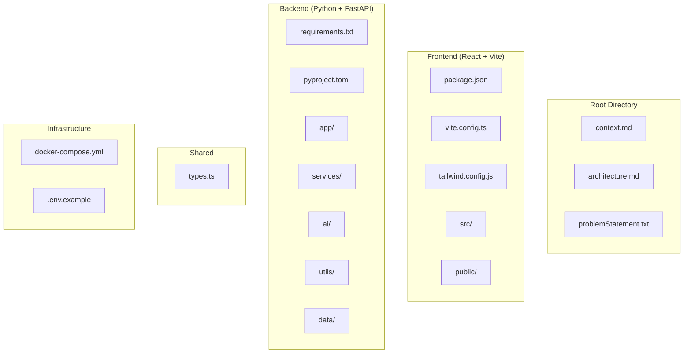
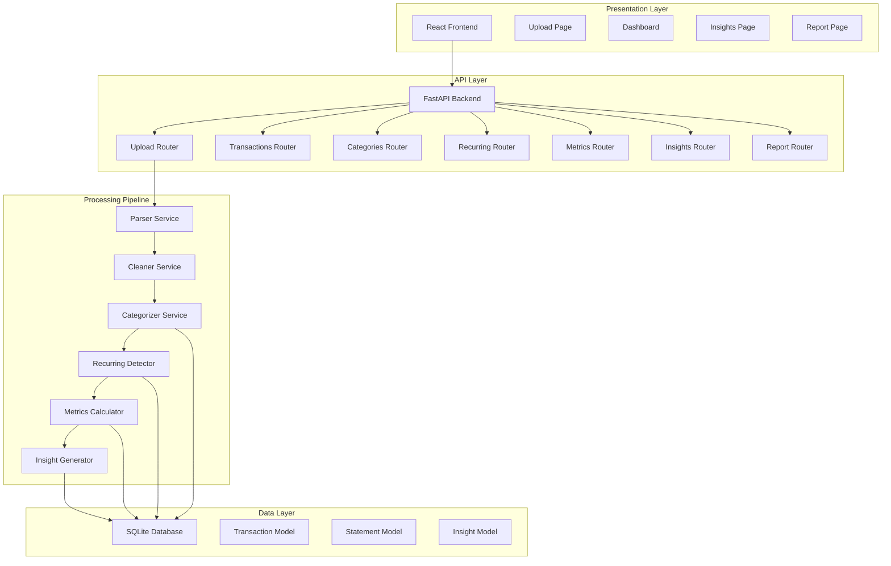
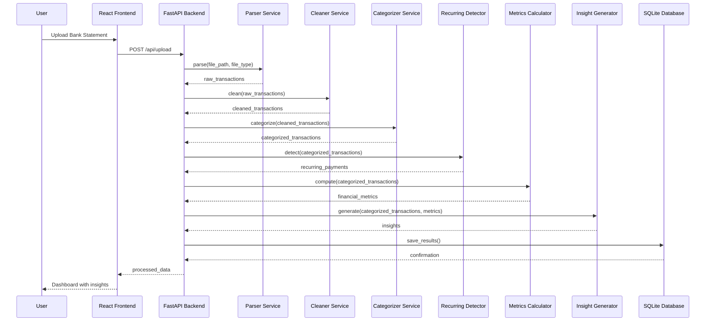
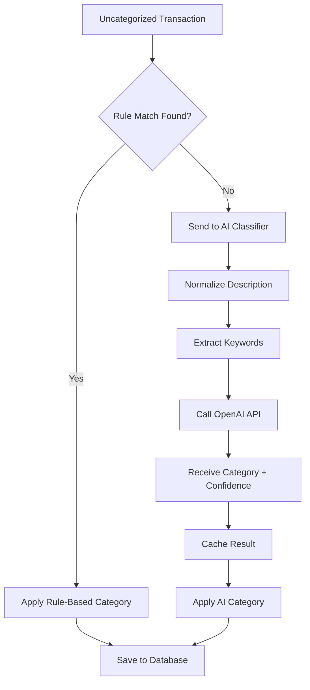
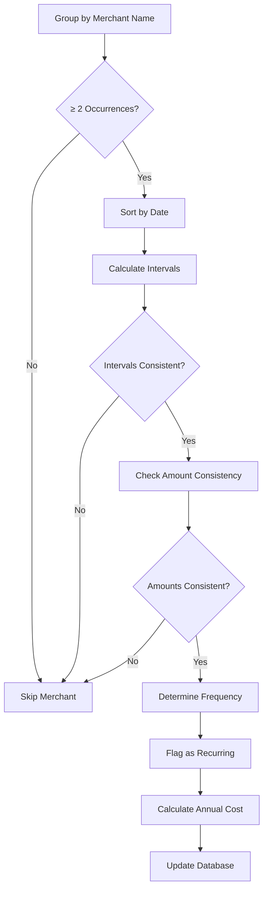

# Development Guide

<cite>
**Referenced Files in This Document**
- [context.md](file://context.md)
- [architecture.md](file://architecture.md)
- [problemStatement.txt](file://problemStatement.txt)
</cite>

## Table of Contents
1. [Introduction](#introduction)
2. [Project Structure](#project-structure)
3. [Core Components](#core-components)
4. [Architecture Overview](#architecture-overview)
5. [Detailed Component Analysis](#detailed-component-analysis)
6. [Implementation Guidelines](#implementation-guidelines)
7. [Testing Strategy](#testing-strategy)
8. [Development Environment Setup](#development-environment-setup)
9. [Integration Points](#integration-points)
10. [Performance Considerations](#performance-considerations)
11. [Troubleshooting Guide](#troubleshooting-guide)
12. [Conclusion](#conclusion)

## Introduction

RupeeRadar is an AI-powered personal finance assistant designed to help working professionals understand their spending patterns by analyzing bank statement data. The application transforms raw, messy financial transaction data into meaningful personal finance insights through an end-to-end automated workflow.

The system follows a client-server architecture with a React frontend and Python FastAPI backend, providing a comprehensive solution for transaction processing, categorization, recurring payment detection, financial analytics, and insight generation.

## Project Structure

The project follows a modular architecture with clear separation of concerns across frontend, backend, and shared components:

**Diagram sources**
- [architecture.md:73-186](file://architecture.md#L73-L186)

**Section sources**
- [architecture.md:73-186](file://architecture.md#L73-L186)

## Core Components

The system consists of six primary processing stages that form the complete data pipeline:

### 1. Parser Module
Responsible for extracting raw transaction data from bank statements in CSV and PDF formats.

### 2. Cleaner Module  
Handles data normalization, including date parsing, amount standardization, description cleaning, and duplicate removal.

### 3. Categorizer Module
Implements hybrid categorization using rule-based matching and AI-powered classification.

### 4. Recurring Detector
Identifies patterns in transaction timing and amounts to detect recurring payments.

### 5. Metrics Calculator
Computes financial metrics including income, spending, savings, and category breakdowns.

### 6. Insight Generator
Creates personalized financial insights using AI with references to actual transaction amounts.

**Section sources**
- [architecture.md:190-240](file://architecture.md#L190-L240)

## Architecture Overview

The system follows a layered architecture with clear separation between presentation, business logic, and data persistence:

**Diagram sources**
- [architecture.md:3-48](file://architecture.md#L3-L48)
- [architecture.md:407-438](file://architecture.md#L407-L438)

**Section sources**
- [architecture.md:3-48](file://architecture.md#L3-L48)
- [architecture.md:407-438](file://architecture.md#L407-L438)

## Detailed Component Analysis

### Data Processing Pipeline

The end-to-end processing pipeline follows a six-stage workflow:

**Diagram sources**
- [architecture.md:413-438](file://architecture.md#L413-L438)

### Categorization Strategy

The categorization system uses a hybrid approach combining rule-based matching with AI-powered classification:

**Diagram sources**
- [architecture.md:440-452](file://architecture.md#L440-L452)

### Recurring Payment Detection Algorithm

The recurring detection algorithm analyzes temporal patterns and amount consistency:

**Diagram sources**
- [architecture.md:453-466](file://architecture.md#L453-L466)

**Section sources**
- [architecture.md:190-240](file://architecture.md#L190-L240)
- [architecture.md:440-466](file://architecture.md#L440-L466)

## Implementation Guidelines

### Development Environment Setup

#### Prerequisites
- Python 3.11+ for backend development
- Node.js 16+ for frontend development
- Docker for containerized deployment
- Git for version control

#### Backend Setup
1. Navigate to the backend directory
2. Install dependencies using pip
3. Configure environment variables from .env.example
4. Initialize the database using Alembic migrations

#### Frontend Setup
1. Navigate to the frontend directory
2. Install dependencies using npm
3. Configure environment variables
4. Start development server with hot reload

#### Database Configuration
- SQLite database with SQLAlchemy ORM
- Automatic migrations using Alembic
- Local file-based storage for privacy

**Section sources**
- [architecture.md:509-547](file://architecture.md#L509-L547)

### Coding Standards and Conventions

#### Backend (Python)
- Use type hints for all function signatures
- Follow PEP 8 style guidelines
- Implement comprehensive error handling
- Use Pydantic models for data validation
- Write docstrings for all public functions

#### Frontend (TypeScript/React)
- Use TypeScript for type safety
- Follow React functional component patterns
- Implement proper state management with Zustand
- Use Tailwind CSS for styling
- Write comprehensive component tests

#### API Design
- RESTful endpoints with clear HTTP methods
- Consistent JSON response schemas
- Proper error codes and messages
- Input validation using Pydantic
- Pagination for large datasets

**Section sources**
- [architecture.md:242-316](file://architecture.md#L242-L316)

### Modular Architecture Design

The system is designed with modularity in mind to allow for easy extension and customization:

#### Pluggable Categorization Algorithms
- Define interfaces for categorization services
- Support multiple categorization strategies
- Enable dynamic switching between algorithms
- Maintain backward compatibility

#### Configurable Input Format Parsers
- Abstract parser interfaces for different formats
- Support for CSV, PDF, and future formats
- Configurable field mappings
- Extensible parser registry

#### Customizable Category Definitions
- JSON-based category configuration
- Support for custom keywords and patterns
- Dynamic category updates
- Hierarchical category structures

#### Extensible Analytics Engine
- Plugin-based metric calculators
- Configurable analytics pipelines
- Support for custom indicators
- Real-time analytics capabilities

**Section sources**
- [architecture.md:440-452](file://architecture.md#L440-L452)
- [architecture.md:453-466](file://architecture.md#L453-L466)

## Testing Strategy

### Backend Testing Approach

#### Unit Testing
- Test individual services in isolation
- Mock external dependencies (OpenAI API)
- Validate data transformations
- Test error scenarios and edge cases

#### Integration Testing
- Test complete processing pipelines
- Validate database operations
- Test API endpoint responses
- Validate file upload and processing

#### Performance Testing
- Load testing with large datasets
- API response time measurements
- Memory usage monitoring
- Concurrent request handling

### Frontend Testing Approach

#### Component Testing
- Test React components in isolation
- Validate state management
- Test user interactions
- Validate data visualization components

#### Integration Testing
- Test complete user workflows
- Validate API integration
- Test file upload and processing
- Validate dashboard rendering

#### End-to-End Testing
- Test complete user journey
- Validate error handling
- Test responsive design
- Validate accessibility

**Section sources**
- [architecture.md:573-587](file://architecture.md#L573-L587)

## Development Environment Setup

### Local Development

#### Docker Compose Setup
1. Build frontend and backend images
2. Configure volume mounts for development
3. Set up environment variables
4. Start all services with proper networking

#### Manual Setup
1. Set up Python virtual environment
2. Install Node.js dependencies
3. Configure database connections
4. Set up development servers

### Cloud Deployment

#### Containerized Deployment
- Docker images for frontend and backend
- Kubernetes manifests for orchestration
- Environment-specific configurations
- Health checks and monitoring

#### Platform Deployment
- Vercel for frontend static hosting
- Railway/Render for backend deployment
- Self-hosted options for full control

**Section sources**
- [architecture.md:509-556](file://architecture.md#L509-L556)

## Integration Points

### Banking Platform Integrations

#### Direct Bank APIs
- OAuth-based authentication
- Secure token storage
- Real-time transaction feeds
- Account aggregation

#### Statement Import
- CSV export from banking apps
- PDF statement processing
- Mobile app integrations
- Third-party aggregator support

### Cloud Services

#### AI/ML Services
- OpenAI API integration
- Structured response parsing
- Rate limiting and retries
- Cost optimization strategies

#### Storage Services
- Local file storage for privacy
- Cloud storage for backups
- CDN for asset delivery
- Database-as-a-service options

### Third-Party Libraries

#### Data Processing
- pandas for data manipulation
- pdfplumber for PDF parsing
- NumPy for numerical computations
- OpenCV for image processing

#### Web Frameworks
- FastAPI for backend APIs
- React for frontend UI
- Vite for build tooling
- Tailwind CSS for styling

**Section sources**
- [architecture.md:52-69](file://architecture.md#L52-L69)

## Performance Considerations

### Scalability Strategies

#### Horizontal Scaling
- Stateless API design
- Load balancer configuration
- Database connection pooling
- Caching layer implementation

#### Performance Optimization
- Asynchronous processing for long operations
- Batch processing for AI requests
- Database indexing strategies
- CDN for static assets

### Memory Management

#### Data Processing
- Streaming large file processing
- Memory-efficient data structures
- Garbage collection optimization
- Resource cleanup strategies

#### API Responses
- Pagination for large datasets
- Lazy loading for dashboard components
- Efficient JSON serialization
- Compression for API responses

**Section sources**
- [architecture.md:590-600](file://architecture.md#L590-L600)

## Troubleshooting Guide

### Common Issues and Solutions

#### File Processing Errors
- Unsupported file formats
- Corrupted or unreadable files
- Memory issues with large statements
- Encoding problems in CSV files

#### AI Integration Issues
- API rate limiting and quotas
- Network connectivity problems
- Response parsing failures
- Model timeout errors

#### Database Issues
- SQLite file locking
- Migration conflicts
- Connection pool exhaustion
- Disk space limitations

#### Frontend Problems
- CORS configuration issues
- State synchronization problems
- Chart rendering failures
- Responsive design issues

### Debugging Strategies

#### Backend Debugging
- Comprehensive logging with structured data
- Error tracking and monitoring
- Performance profiling
- Database query optimization

#### Frontend Debugging
- React DevTools for component inspection
- Network tab for API debugging
- Console logging for state tracking
- Performance profiling tools

**Section sources**
- [architecture.md:559-571](file://architecture.md#L559-L571)

## Conclusion

RupeeRadar provides a comprehensive foundation for building an AI-powered personal finance assistant. The modular architecture, combined with the detailed processing pipeline, offers flexibility for customization while maintaining robustness and scalability.

The system's emphasis on privacy, with local-first data handling and minimal AI data exposure, aligns with responsible AI development practices. The hybrid categorization approach ensures both accuracy and cost-effectiveness.

Key development considerations include:
- Maintaining the modular architecture for extensibility
- Ensuring comprehensive error handling and logging
- Optimizing for performance with large datasets
- Following security best practices for financial data
- Implementing thorough testing strategies

The documented architecture and implementation guidelines provide a solid foundation for developing a production-ready personal finance analysis platform that can handle real-world messy transaction descriptions while delivering meaningful financial insights.