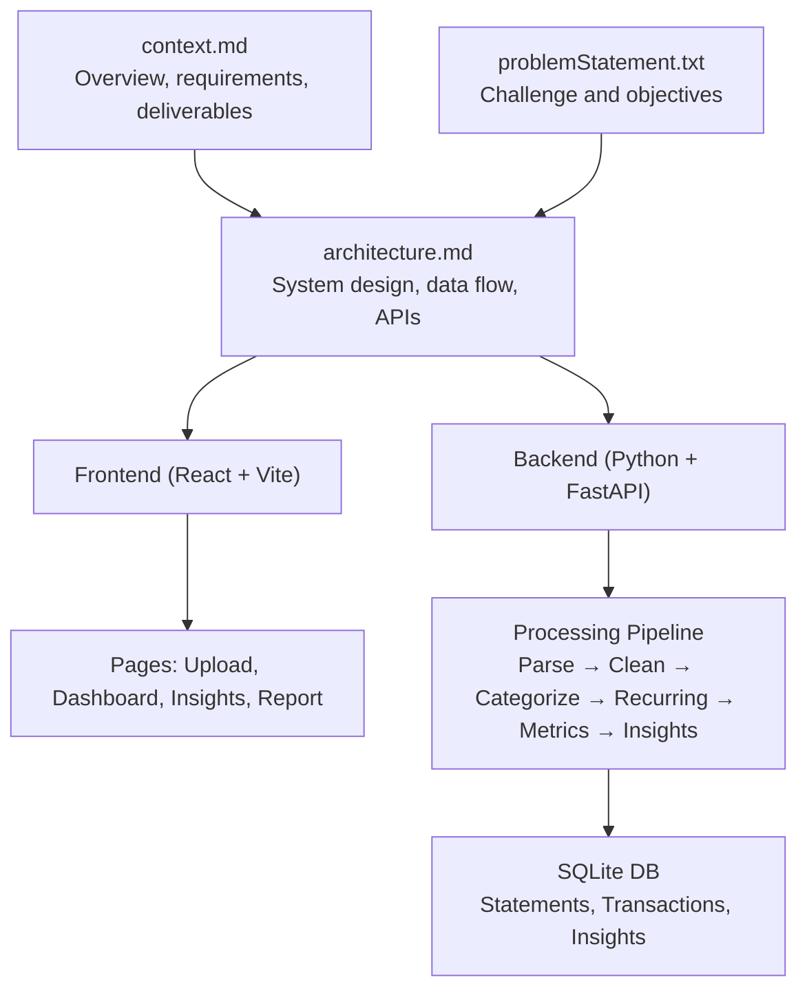
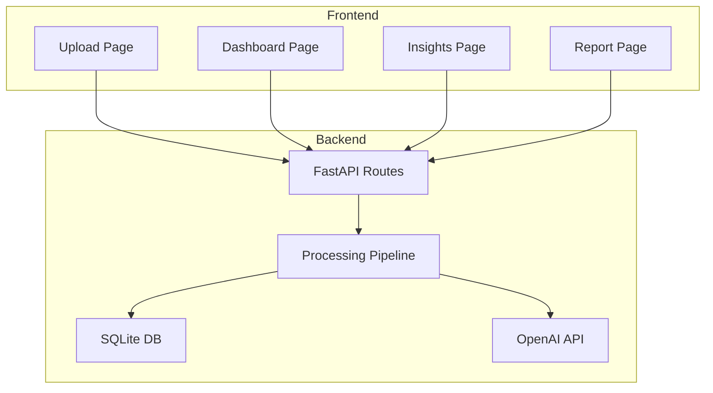
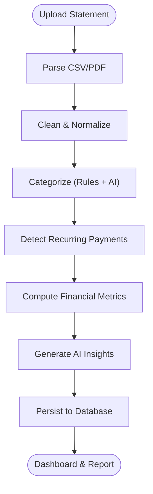
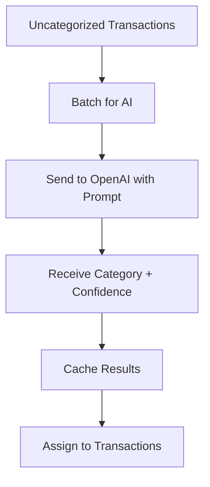
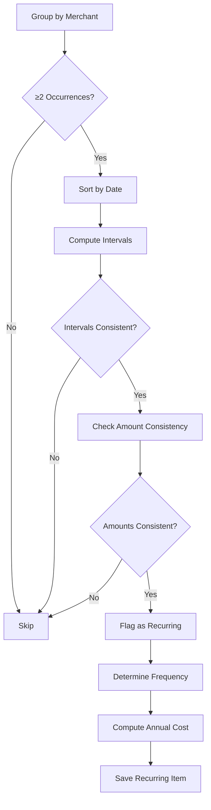
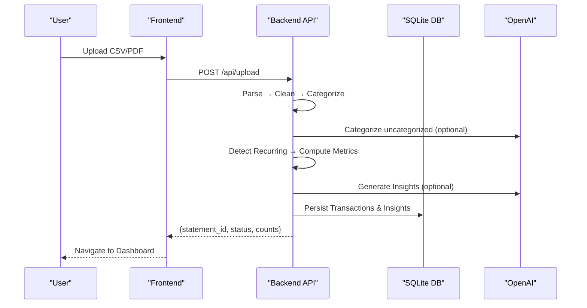
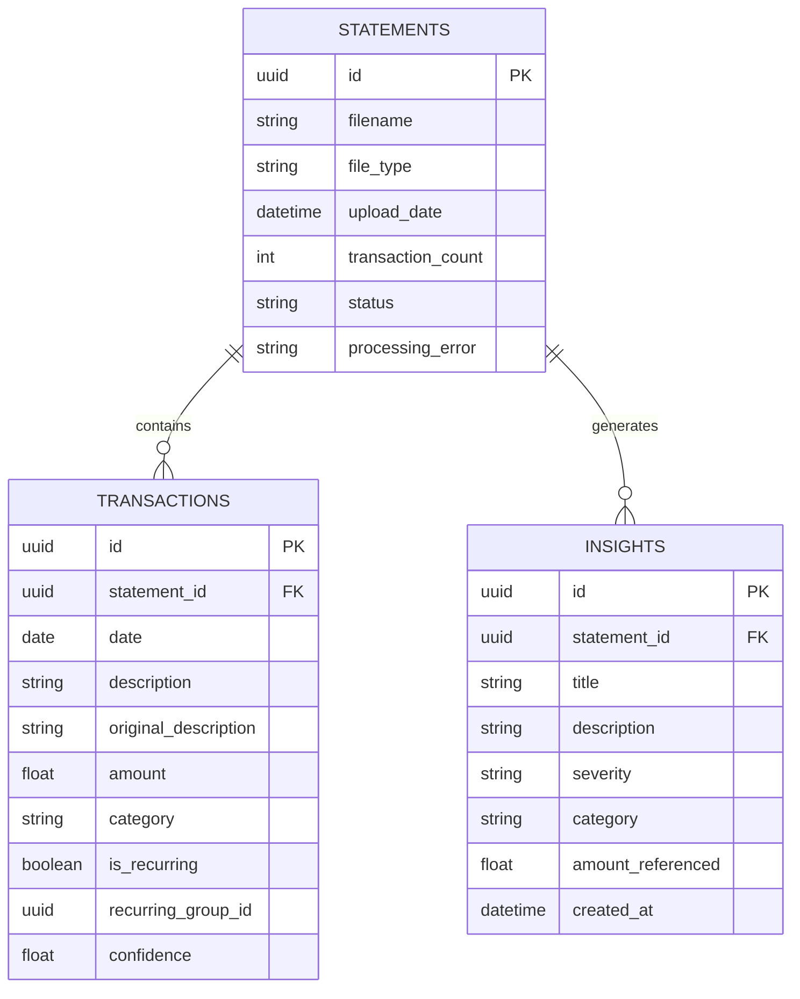
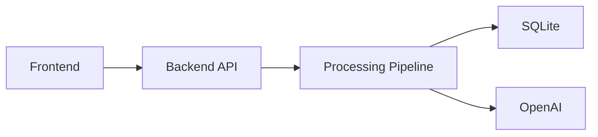

# Project Overview

<cite>
**Referenced Files in This Document**
- [context.md](file://context.md)
- [problemStatement.txt](file://problemStatement.txt)
- [architecture.md](file://architecture.md)
</cite>

## Table of Contents
1. [Introduction](#introduction)
2. [Project Structure](#project-structure)
3. [Core Components](#core-components)
4. [Architecture Overview](#architecture-overview)
5. [Detailed Component Analysis](#detailed-component-analysis)
6. [Dependency Analysis](#dependency-analysis)
7. [Performance Considerations](#performance-considerations)
8. [Troubleshooting Guide](#troubleshooting-guide)
9. [Conclusion](#conclusion)
10. [Appendices](#appendices)

## Introduction
RupeeRadar is an AI-powered personal finance assistant designed to transform messy, unstructured bank statement data into meaningful financial insights for working professionals. The project automates the entire journey from raw transaction uploads to actionable dashboards and personalized recommendations, solving the core challenge of understanding where money goes across diverse payment channels such as UPI, cards, bank transfers, EMIs, rent, subscriptions, and investments.

At its heart, RupeeRadar focuses on four pillars:
- Transaction cleaning: extracting, normalizing, and deduplicating transactions
- Categorization: assigning transactions to meaningful categories (e.g., Food, Travel, Shopping, Bills, EMI, Subscriptions, Salary, Rent, Investments, Other)
- Recurring detection: identifying regular subscriptions, EMIs, rent, SIPs, and insurance payments
- Financial insights: generating human-readable, data-backed recommendations grounded in actual amounts and trends

The end-to-end workflow ensures privacy-conscious handling of sensitive financial data, delivering a clear personal finance summary that answers key questions like:
- What are my biggest spending categories?
- How much did I spend this month?
- Which transactions are recurring subscriptions or EMIs?
- What was my biggest transaction?
- What are the top insights from my spending behavior?

## Project Structure
The repository organizes content around three primary documents:
- context.md: Provides the project overview, problem statement, user questions, core requirements, deliverables, evaluation criteria, constraints, and final deliverable
- problemStatement.txt: Reinforces the background, challenge, and objectives aligned with the broader AI challenge context
- architecture.md: Documents the system architecture, tech stack, directory structure, data flow, API design, database schema, frontend/backend components, security/privacy, deployment, error handling, testing, and performance considerations

**Diagram sources**
- [context.md:1-80](file://context.md#L1-L80)
- [problemStatement.txt:1-43](file://problemStatement.txt#L1-L43)
- [architecture.md:73-186](file://architecture.md#L73-L186)

**Section sources**
- [context.md:1-80](file://context.md#L1-L80)
- [problemStatement.txt:1-43](file://problemStatement.txt#L1-L43)
- [architecture.md:73-186](file://architecture.md#L73-L186)

## Core Components
- Data Input: Accepts bank statement data as CSV or PDF via a simple upload flow
- Transaction Cleaning: Parses, normalizes, and cleans transaction rows into a structured format
- Categorization: Hybrid approach combining rule-based keyword matching and AI-powered classification
- Recurring Detection: Identifies recurring payments by grouping merchant names, analyzing temporal patterns, and validating amount consistency
- Financial Metrics: Computes total income, total spend, savings, savings rate, top categories, biggest transactions, and monthly breakdowns
- Insight Generation: Uses AI to produce personalized, human-readable insights referencing actual amounts and categories
- Output Presentation: Presents results through a dashboard, charts, tables, and a downloadable PDF report

These components collectively enable RupeeRadar to convert raw financial transaction data into a clear, actionable personal finance summary.

**Section sources**
- [context.md:21-41](file://context.md#L21-L41)
- [architecture.md:190-240](file://architecture.md#L190-L240)

## Architecture Overview
RupeeRadar follows a client-server architecture:
- Frontend (React + Vite): Interactive UI for upload, dashboard, insights, and report generation
- Backend (Python + FastAPI): Data processing, AI categorization, recurring detection, metrics computation, and insight generation
- Database (SQLite via SQLAlchemy): Stores statements, transactions, and insights
- AI Services (OpenAI): Power hybrid categorization and insight generation
- File Parsing (pdfplumber + csv): Handles CSV and PDF statement extraction

**Diagram sources**
- [architecture.md:3-48](file://architecture.md#L3-L48)
- [architecture.md:125-183](file://architecture.md#L125-L183)

**Section sources**
- [architecture.md:3-48](file://architecture.md#L3-L48)
- [architecture.md:52-70](file://architecture.md#L52-L70)

## Detailed Component Analysis

### End-to-End Workflow
The system processes uploaded statements through six stages:
1. Parse: Extract raw rows from CSV/PDF
2. Clean: Normalize dates, amounts, and descriptions; remove duplicates
3. Categorize: Rule-based first pass; AI-powered second pass for remaining uncategorized transactions
4. Detect Recurring: Group by merchant, analyze periodicity and amount consistency
5. Compute Metrics: Aggregate totals, savings, top categories, biggest transactions, monthly breakdowns
6. Generate Insights: Produce personalized insights referencing actual amounts and categories

**Diagram sources**
- [architecture.md:190-240](file://architecture.md#L190-L240)

**Section sources**
- [architecture.md:190-240](file://architecture.md#L190-L240)

### Categorization Strategy (Rules + AI)
- Rule-based first pass: Keyword dictionaries and patterns cover common Indian transaction descriptions (~60–70%)
- AI-powered second pass: Uncategorized transactions are batched and sent to OpenAI with structured prompts; results cached to reduce API calls

**Diagram sources**
- [architecture.md:440-452](file://architecture.md#L440-L452)

**Section sources**
- [architecture.md:440-452](file://architecture.md#L440-L452)

### Recurring Detection Algorithm
- Group transactions by normalized merchant name
- Sort by date and compute intervals; check consistency within tolerances
- Validate amount consistency across occurrences
- Cross-reference known recurring merchants
- Compute annual projected cost and determine frequency

**Diagram sources**
- [architecture.md:453-466](file://architecture.md#L453-L466)

**Section sources**
- [architecture.md:453-466](file://architecture.md#L453-L466)

### API Endpoints and Data Contracts
Key endpoints include upload, transactions listing, category breakdown, recurring payments, financial metrics, and PDF report generation. Response schemas define transaction records, metrics, recurring items, and insights.

**Diagram sources**
- [architecture.md:242-316](file://architecture.md#L242-L316)

**Section sources**
- [architecture.md:242-316](file://architecture.md#L242-L316)

### Database Schema
Three core tables capture statements, transactions, and insights with foreign key relationships and metadata for processing status and error handling.

**Diagram sources**
- [architecture.md:319-359](file://architecture.md#L319-L359)

**Section sources**
- [architecture.md:319-359](file://architecture.md#L319-L359)

## Dependency Analysis
- Frontend depends on backend REST endpoints for data fetching and report generation
- Backend orchestrates the processing pipeline and integrates with AI services for categorization and insights
- Database persists processed results and supports dashboard queries
- AI services augment rule-based logic to improve accuracy on messy descriptions

**Diagram sources**
- [architecture.md:407-438](file://architecture.md#L407-L438)

**Section sources**
- [architecture.md:407-438](file://architecture.md#L407-L438)

## Performance Considerations
- Large statements are handled via paginated API responses and streaming PDF reports
- OpenAI API latency mitigated by batching uncategorized transactions and caching AI results
- Rule-based first pass reduces AI calls to approximately 30–40% of total transactions
- Dashboard rendering optimized with memoized charts and lazy-loaded pages
- PDF generation pre-computed and cached post-processing

**Section sources**
- [architecture.md:590-600](file://architecture.md#L590-L600)

## Troubleshooting Guide
Common scenarios and handling strategies:
- Unsupported file format: Return 400 with supported formats list
- Corrupted/unreadable file: Return 422 with parsing error details
- OpenAI API failure: Fall back to rule-only categorization; log error
- OpenAI rate limit: Batch with delays; retry with exponential backoff
- Empty statement (0 transactions): Return 200 with empty results; warn user
- Database write failure: Transaction rollback; mark statement as failed
- Missing fields in transaction: Skip row with warning log; continue processing

**Section sources**
- [architecture.md:559-570](file://architecture.md#L559-L570)

## Conclusion
RupeeRadar delivers a practical, privacy-conscious solution for turning messy bank statements into clear financial insights. By combining robust data cleaning, hybrid categorization, intelligent recurring detection, and AI-driven insights, it empowers working professionals to understand their spending patterns, identify recurring obligations, and receive personalized recommendations grounded in their actual financial data. The modular architecture and end-to-end workflow make it suitable for rapid prototyping and future enhancements.

[No sources needed since this section summarizes without analyzing specific files]

## Appendices

### Practical Use Cases
- Analyze monthly spending patterns: Compare income versus spend across months and drill down into top categories
- Identify recurring subscriptions: Review flagged recurring items and assess annual costs
- Generate personalized recommendations: Use AI-generated insights to optimize spending and saving behavior

**Section sources**
- [context.md:13-19](file://context.md#L13-L19)
- [architecture.md:225-239](file://architecture.md#L225-L239)

### Target Audience and Value Proposition
- Target audience: Working professionals who manage diverse transaction streams and want automated, privacy-preserving insights
- Value proposition: Convert raw, inconsistent transaction data into actionable, human-readable summaries with minimal effort

**Section sources**
- [context.md:5-6](file://context.md#L5-L6)
- [problemStatement.txt:2-8](file://problemStatement.txt#L2-L8)