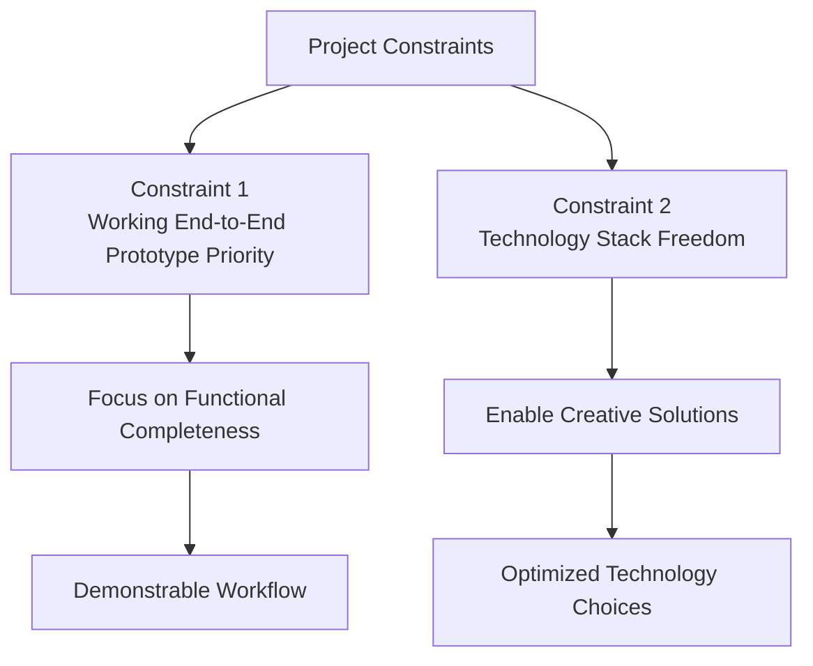
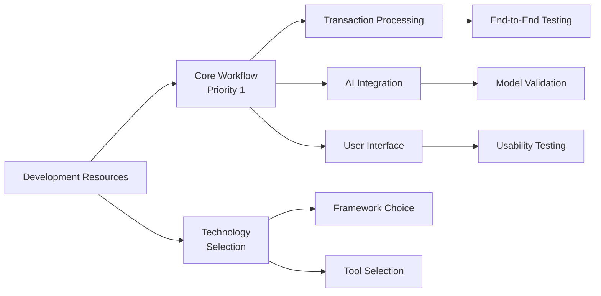

# Constraints and Limitations

<cite>
**Referenced Files in This Document**
- [context.md](file://context.md)
- [problemStatement.txt](file://problemStatement.txt)
- [architecture.md](file://architecture.md)
</cite>

## Table of Contents
1. [Introduction](#introduction)
2. [Constraint Overview](#constraint-overview)
3. [Constraint 1: Working End-to-End Prototype Priority](#constraint-1-working-end-to-end-prototype-priority)
4. [Constraint 2: Technology Stack Freedom](#constraint-2-technology-stack-freedom)
5. [Impact on Development Decisions](#impact-on-development-decisions)
6. [Scope and Deliverable Expectations](#scope-and-deliverable-expectations)
7. [Balancing Constraint Adherence with Innovation](#balancing-constraint-adherence-with-innovation)
8. [Best Practices for Constraint Compliance](#best-practices-for-constraint-compliance)
9. [Conclusion](#conclusion)

## Introduction

The RUPEERADAR project operates under two fundamental constraints that guide its development approach and shape the overall architecture. These constraints reflect a pragmatic balance between achieving functional completeness and maintaining flexibility for innovative solutions. Understanding these constraints is essential for making informed development decisions and managing stakeholder expectations throughout the project lifecycle.

## Constraint Overview

The project's constraints are deliberately designed to prioritize practical outcomes over theoretical perfection. They establish clear boundaries that enable rapid prototyping while preserving room for creative problem-solving and technology innovation.

**Section sources**
- [context.md:52-56](file://context.md#L52-L56)
- [problemStatement.txt:40-41](file://problemStatement.txt#L40-L41)

## Constraint 1: Working End-to-End Prototype Priority

### Rationale and Purpose

The first constraint prioritizes delivering a fully functional end-to-end prototype over achieving perfect support for every bank format. This approach serves several strategic purposes:

- **Risk Mitigation**: Ensures core functionality works before attempting to solve every edge case
- **Value Delivery**: Provides immediate demonstrable value rather than delayed perfection
- **Resource Optimization**: Focuses limited development resources on the most critical user workflows
- **Learning Acceleration**: Enables rapid iteration based on real user feedback

### Impact on Development Decisions

This constraint fundamentally influences architectural and implementation choices:

**Feature Scope Selection**: The development team focuses on the core workflow defined in the problem statement, including transaction parsing, cleaning, categorization, recurring detection, metrics calculation, and insight generation.

**Bank Format Strategy**: Rather than attempting to support every bank's unique statement format immediately, the solution targets the most common formats (CSV and PDF) with robust parsing capabilities.

**Quality vs. Completeness Trade-offs**: When faced with competing priorities, the team chooses solutions that complete the workflow over those that add marginal improvements to edge cases.

### Technical Implications

The constraint shapes the technical architecture in several ways:

- **Progressive Enhancement**: Start with basic functionality and iteratively add support for additional formats
- **Fallback Mechanisms**: Implement graceful degradation when encountering unsupported formats
- **Validation Focus**: Prioritize end-to-end testing over format-specific edge case coverage

**Section sources**
- [context.md:54](file://context.md#L54)
- [problemStatement.txt:40](file://problemStatement.txt#L40)
- [context.md:34-41](file://context.md#L34-L41)

## Constraint 2: Technology Stack Freedom

### Rationale and Purpose

The second constraint grants participants complete freedom to choose their technology stack and implementation approach. This flexibility serves multiple strategic objectives:

- **Innovation Encouragement**: Allows teams to leverage cutting-edge technologies and approaches
- **Skill Optimization**: Enables developers to use familiar tools and frameworks effectively
- **Solution Diversity**: Promotes varied approaches to solving the same problem
- **Real-World Relevance**: Mirrors actual development environments where technology choices vary

### Impact on Development Decisions

This constraint provides significant latitude in architectural and implementation choices:

**Framework Selection**: Teams can choose from various frontend frameworks (React, Vue, Angular) and backend technologies (Python, Node.js, Go, Rust) based on their expertise and requirements.

**Architectural Patterns**: Different approaches to data processing, AI integration, and user interface design are permitted, encouraging creative solutions.

**Tooling and Infrastructure**: Teams can select appropriate databases, caching systems, deployment strategies, and monitoring tools based on their specific needs.

### Implementation Flexibility

The constraint enables several beneficial approaches:

- **Hybrid Solutions**: Combining multiple technologies strategically for optimal results
- **Custom Integrations**: Developing specialized components when off-the-shelf solutions don't meet requirements
- **Performance Optimization**: Selecting technologies best suited for specific performance characteristics

**Section sources**
- [context.md:55](file://context.md#L55)
- [problemStatement.txt:41](file://problemStatement.txt#L41)
- [architecture.md:52-70](file://architecture.md#L52-L70)

## Impact on Development Decisions

### Resource Allocation Strategy

The constraints guide how development resources should be allocated:

### Timeline Management

The constraints influence project scheduling and milestone setting:

- **Milestone Focus**: Primary milestones center on completing the end-to-end workflow
- **Format Expansion**: Additional bank format support can be planned as post-milestone enhancements
- **Technology Exploration**: Time can be allocated for experimenting with different technology combinations

### Quality Assurance Approach

The constraints shape quality assurance strategies:

- **Functional Testing**: Emphasize end-to-end workflow validation over format-specific edge cases
- **User Experience**: Prioritize intuitive user interfaces and smooth workflows
- **Performance**: Focus on responsive, reliable operation rather than micro-optimizations

**Section sources**
- [context.md:21-31](file://context.md#L21-L31)
- [architecture.md:190-240](file://architecture.md#L190-L240)

## Scope and Deliverable Expectations

### Core Scope Definition

The constraints define the project's core scope around the end-to-end workflow:

**Primary Deliverables**:
- Working prototype demonstrating complete transaction processing pipeline
- Cleaned and categorized transaction data
- Recurring payment detection capabilities
- Comprehensive spending dashboard
- Personalized financial insights
- Final report generation and sharing capability

**Supported Formats**: Initial focus on CSV and PDF bank statements with potential expansion to additional formats post-prototype.

### Quality Expectations

The constraints establish clear quality benchmarks:

- **Workflow Completeness**: All steps from upload to final report must function cohesively
- **Accuracy Standards**: Transaction cleaning and categorization must demonstrate reasonable accuracy
- **User Experience**: Interface should be intuitive and provide clear value to users
- **Privacy Protection**: Sensitive financial data must be handled securely and privately

### Post-Prototype Opportunities

The constraints acknowledge that additional features can be developed after the initial prototype:

- **Enhanced Format Support**: Expanding to additional bank formats and providers
- **Advanced Features**: Incorporating user authentication, historical analysis, and budgeting tools
- **Performance Improvements**: Optimizing for larger datasets and improved user experiences

**Section sources**
- [context.md:32-41](file://context.md#L32-L41)
- [problemStatement.txt:24-31](file://problemStatement.txt#L24-L31)
- [context.md:59](file://context.md#L59)

## Balancing Constraint Adherence with Innovation

### Strategic Innovation Areas

While adhering to the constraints, teams can pursue innovation in several areas:

**Processing Efficiency**: Developing novel approaches to transaction parsing, cleaning, and categorization that improve accuracy or performance.

**User Experience**: Creating innovative dashboard designs, visualization techniques, or interaction patterns that enhance user understanding of financial data.

**AI Integration**: Experimenting with different AI models, prompting strategies, or hybrid approaches that balance accuracy with cost-effectiveness.

**Data Visualization**: Innovating in how financial insights are presented, potentially using emerging visualization techniques or interactive elements.

### Innovation Within Boundaries

Successful innovation occurs when creative solutions align with constraint requirements:

- **End-to-End Focus**: New technologies or approaches must support the complete workflow
- **Practical Value**: Innovative features should enhance rather than complicate the core user experience
- **Scalable Solutions**: Creative approaches should be maintainable and extensible

### Risk Management

Innovation should be balanced against risk:

- **Prototyping First**: Test innovative ideas in isolated components before full integration
- **Fallback Planning**: Ensure alternative approaches if experimental technologies fail
- **Incremental Adoption**: Gradually integrate innovative solutions while maintaining core functionality

**Section sources**
- [architecture.md:440-483](file://architecture.md#L440-L483)
- [context.md:52-56](file://context.md#L52-L56)

## Best Practices for Constraint Compliance

### Development Strategy

To successfully navigate the constraints, teams should adopt these practices:

**Workflow-Centric Development**: Build features that contribute to the end-to-end prototype first, then expand functionality.

**Technology Selection**: Choose technologies that accelerate workflow completion rather than pursuing novelty for its own sake.

**Testing Strategy**: Focus testing efforts on validating complete workflows rather than exhaustively testing every possible edge case.

**Documentation**: Maintain clear records of technology choices and their alignment with constraint requirements.

### Communication Guidelines

Effective communication about constraints involves:

- **Clear Articulation**: Regularly communicate the rationale behind constraint-driven decisions
- **Stakeholder Alignment**: Ensure all stakeholders understand the trade-offs and benefits
- **Progress Documentation**: Demonstrate how constraint adherence leads to valuable outcomes

### Continuous Evaluation

Regular evaluation ensures constraint compliance:

- **Milestone Reviews**: Assess whether development choices align with prototype priorities
- **Technology Audits**: Evaluate if chosen technologies support end-to-end functionality
- **Scope Adjustments**: Make informed decisions about expanding beyond core constraints

**Section sources**
- [context.md:52-56](file://context.md#L52-L56)
- [architecture.md:52-70](file://architecture.md#L52-L70)

## Conclusion

The RUPEERADAR project's constraints represent a deliberate balance between practical outcomes and creative freedom. By prioritizing working end-to-end prototypes over perfect format support, the project maintains focus on delivering demonstrable value quickly. The technology stack freedom constraint enables teams to leverage their expertise and explore innovative solutions while maintaining alignment with core requirements.

These constraints collectively create an environment where technical excellence and creative problem-solving can flourish within defined boundaries. Success requires understanding that constraint adherence isn't about limitation, but rather about focusing energy on what matters most: building a functional, valuable solution that users can immediately benefit from.

The key to successful constraint management lies in recognizing that these limitations serve as enablers for innovation, directing creative energy toward solutions that truly advance the project's mission of helping users understand their financial patterns through automated analysis of bank statement data.