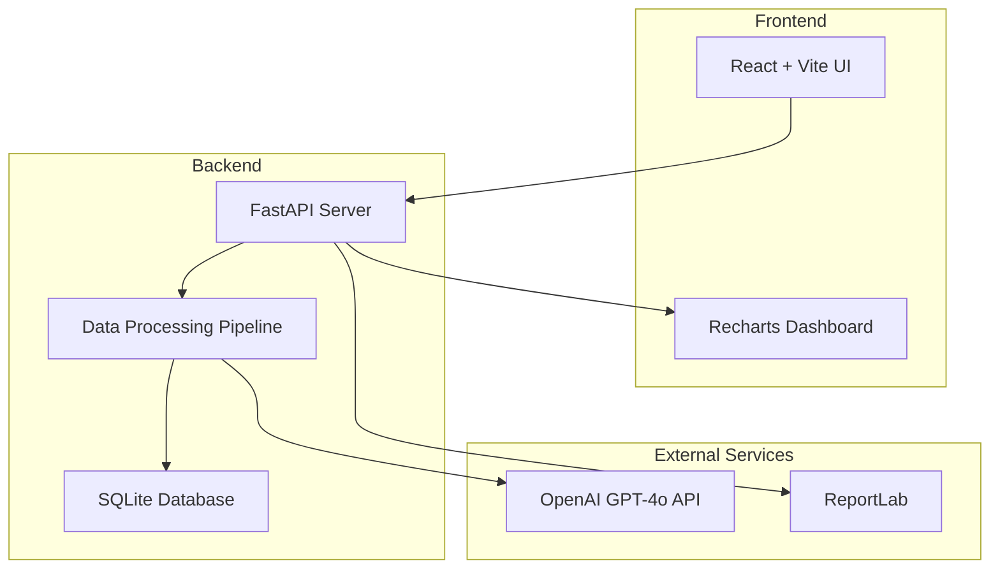
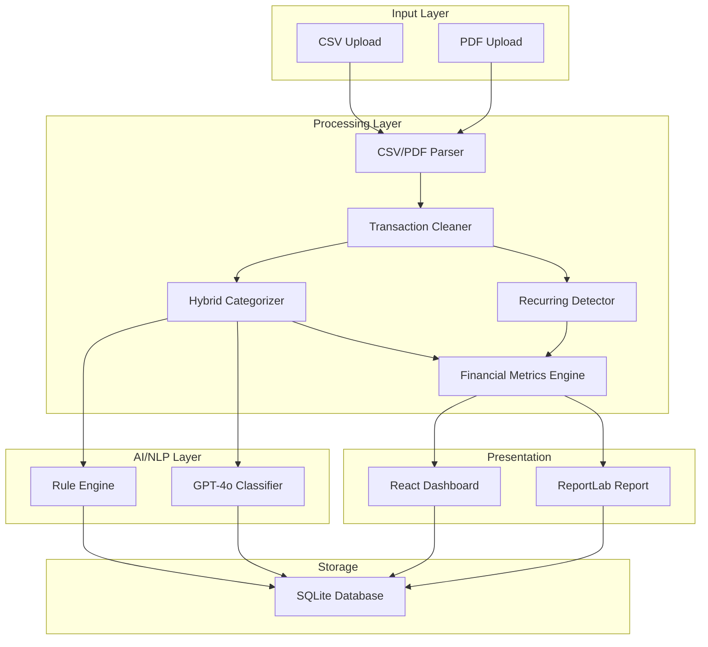
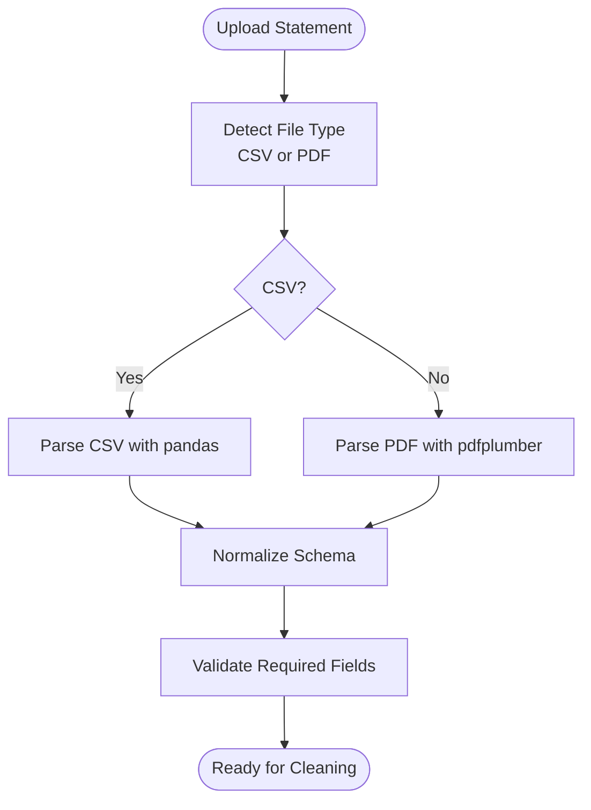
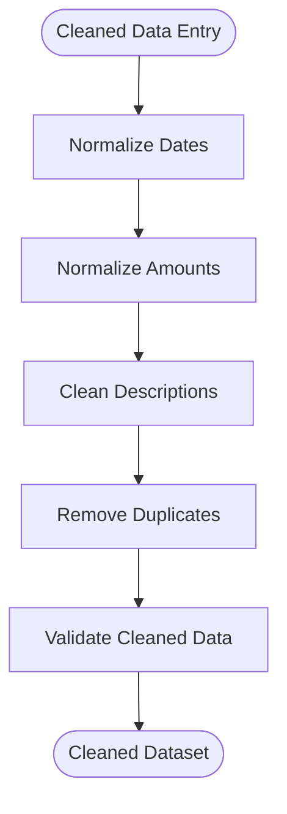
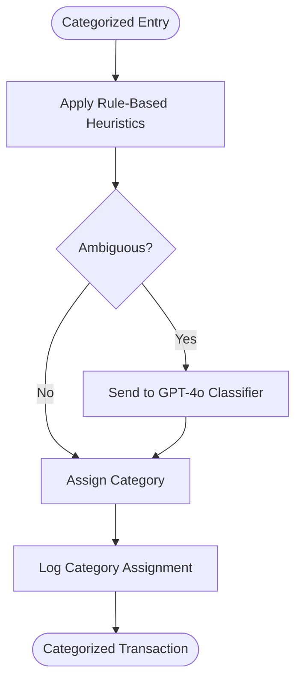
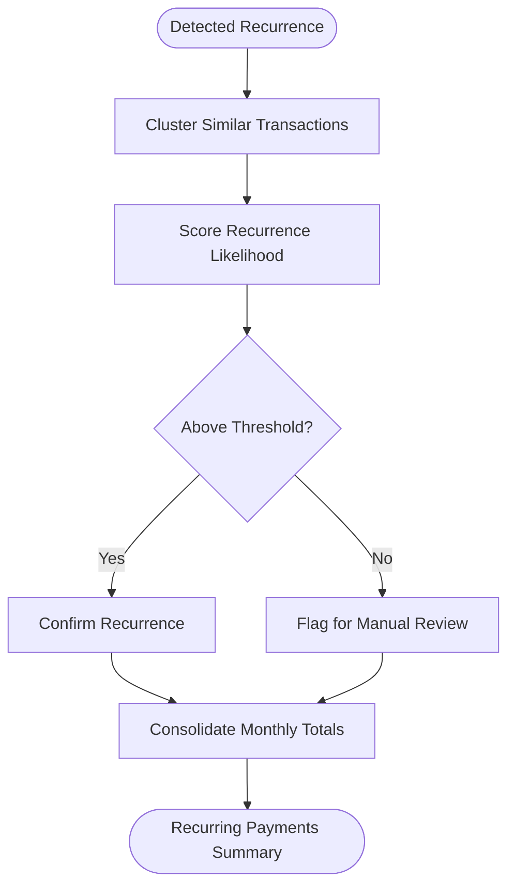
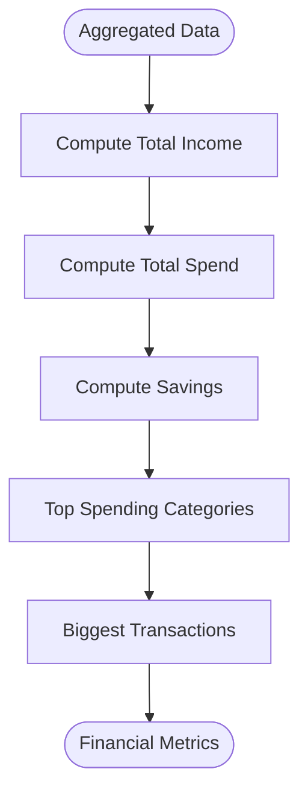
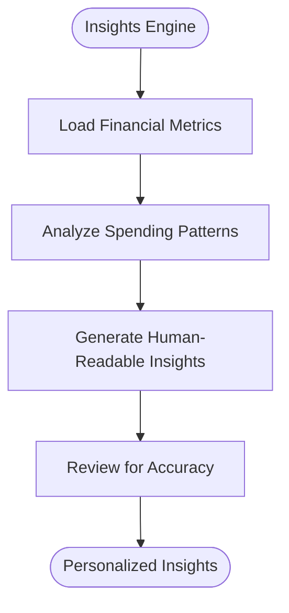
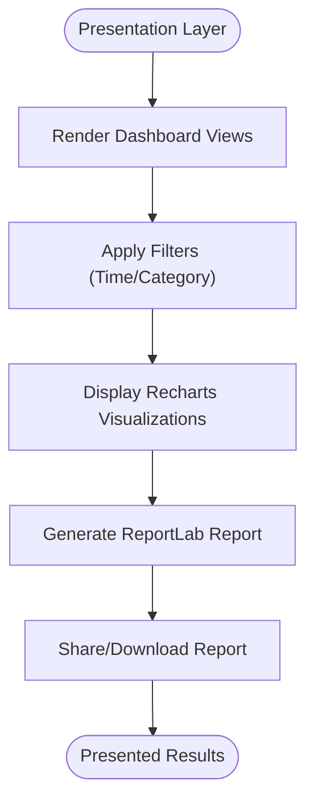
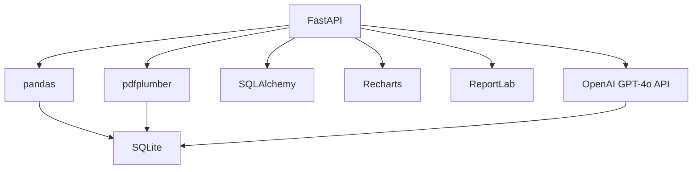

# Core Requirements

<cite>
**Referenced Files in This Document**
- [context.md](file://context.md)
- [problemStatement.txt](file://problemStatement.txt)
</cite>

## Table of Contents
1. [Introduction](#introduction)
2. [Project Structure](#project-structure)
3. [Core Components](#core-components)
4. [Architecture Overview](#architecture-overview)
5. [Detailed Component Analysis](#detailed-component-analysis)
6. [Dependency Analysis](#dependency-analysis)
7. [Performance Considerations](#performance-considerations)
8. [Troubleshooting Guide](#troubleshooting-guide)
9. [Conclusion](#conclusion)

## Introduction
This document details the seven core requirements for RupeeRadar, an AI-powered personal finance assistant designed to transform raw, messy bank statement data into actionable financial insights. The solution focuses on an end-to-end workflow that accepts diverse input formats, cleans and normalizes transactions, applies intelligent categorization, detects recurring payments, computes financial metrics, generates human-readable insights, and presents results through a UI/dashboard/report.

The project emphasizes a working prototype that balances accuracy with practicality, supporting common input formats while ensuring privacy-conscious handling of sensitive financial data.

**Section sources**
- [context.md:1-80](file://context.md#L1-L80)
- [problemStatement.txt:1-43](file://problemStatement.txt#L1-L43)

## Project Structure
The repository currently contains contextual documentation that defines the problem, scope, and high-level architecture decisions. The implementation files are not present in this workspace snapshot, but the documented architecture outlines the technology stack and processing pipeline.

High-level structure based on documented decisions:
- Frontend: React + Vite (UI/dashboard)
- Backend: Python + FastAPI (API and processing)
- Data Processing: Pandas for cleaning; pdfplumber + CSV for parsing
- AI/NLP: OpenAI GPT-4o API (hybrid: rules + AI)
- Database: SQLite via SQLAlchemy
- Visualization: Recharts
- Reports: ReportLab
- Input Formats: CSV and PDF

**Section sources**
- [context.md:61-75](file://context.md#L61-L75)

## Core Components
This section documents each of the seven core requirements with implementation approaches, technical considerations, and acceptance criteria derived from the project context.

### Requirement 1: Data Input Processing
- Purpose: Accept bank statement data as input in common formats.
- Implementation Approach:
  - Support CSV and PDF uploads via the backend API.
  - Parse CSV using pandas for structured tabular data.
  - Parse PDF using pdfplumber to extract text and tabular data.
  - Normalize extracted data into a unified transaction schema.
- Technical Considerations:
  - Handle variable column layouts across banks.
  - Account for OCR artifacts and encoding issues in PDFs.
  - Validate required fields (date, description, amount) before ingestion.
- Acceptance Criteria:
  - Successful upload and parsing of CSV/PDF statements.
  - Structured transaction records with normalized fields.
  - Graceful handling of unsupported or malformed inputs.

**Section sources**
- [context.md:68-71](file://context.md#L68-L71)
- [context.md:23](file://context.md#L23)

### Requirement 2: Transaction Cleaning
- Purpose: Extract and normalize messy transaction descriptions into a structured format.
- Implementation Approach:
  - Use pandas for data manipulation and cleaning.
  - Apply regex-based normalization for dates, amounts, and descriptions.
  - Standardize currency and numeric formats.
  - Remove duplicates and invalid rows.
- Technical Considerations:
  - Robust date parsing to handle multiple formats.
  - Amount normalization to float values with consistent sign.
  - Description cleaning to remove special characters and extra whitespace.
- Acceptance Criteria:
  - Cleaned dataset ready for categorization and analysis.
  - Consistent schema across different input formats.
  - No missing or corrupted transaction entries.

**Section sources**
- [context.md:68](file://context.md#L68)
- [context.md:24](file://context.md#L24)

### Requirement 3: Categorization System
- Purpose: Assign transactions to predefined categories.
- Categories: Food, Travel, Shopping, Bills, EMI, Subscriptions, Salary, Rent, Investments, Other.
- Implementation Approach:
  - Hybrid model: initial rule-based classification, followed by AI refinement using OpenAI GPT-4o API.
  - Maintain category keyword dictionaries and heuristics for common merchant names and descriptions.
  - Use AI to resolve ambiguous or novel descriptions.
- Technical Considerations:
  - Continuous learning: update category rules based on user feedback.
  - Balance speed (rules) and accuracy (AI).
  - Handle edge cases where descriptions are generic or misleading.
- Acceptance Criteria:
  - High accuracy in assigning known categories.
  - Consistent handling of edge cases via AI fallback.
  - Transparent category assignment logs for auditing.

**Section sources**
- [context.md:69](file://context.md#L69)
- [context.md:25-26](file://context.md#L25-L26)

### Requirement 4: Recurring Payment Detection
- Purpose: Identify recurring subscriptions, EMIs, rent, SIPs, and insurance payments.
- Implementation Approach:
  - Pattern-based detection using temporal proximity and amount stability.
  - Clustering algorithms to group similar transactions by description and amount.
  - Machine learning scoring to rank likelihood of recurrence.
- Technical Considerations:
  - Define tolerance windows for amount and date variations.
  - Merge detected recurrences into consolidated monthly summaries.
  - Flag anomalies for manual review.
- Acceptance Criteria:
  - Accurate identification of recurring patterns with minimal false positives.
  - Clear reporting of recurring items with frequency and total cost.
  - User ability to override or adjust detected recurrences.

**Section sources**
- [context.md:27](file://context.md#L27)

### Requirement 5: Financial Metrics Calculation
- Purpose: Compute key financial metrics including income, spend, savings, top categories, and biggest transactions.
- Metrics:
  - Total Income: Sum of all positive amounts.
  - Total Spend: Sum of all negative amounts.
  - Savings: Total Income minus Total Spend.
  - Top Spending Categories: Aggregated by category.
  - Biggest Transactions: Top N by absolute amount.
- Implementation Approach:
  - Aggregate cleaned transactions by category and compute totals.
  - Rank categories and transactions by value.
  - Store computed metrics for dashboard and report generation.
- Technical Considerations:
  - Handle currency normalization consistently.
  - Exclude non-transactional entries (e.g., adjustments).
  - Provide rolling period calculations (monthly/quarterly).
- Acceptance Criteria:
  - Accurate and up-to-date financial summaries.
  - Consistent aggregation across categories and time periods.
  - Clear presentation of top contributors to income and spending.

**Section sources**
- [context.md:28](file://context.md#L28)

### Requirement 6: Insight Generation
- Purpose: Produce human-readable financial recommendations grounded in actual transaction data.
- Implementation Approach:
  - Use AI to synthesize insights from categorized and metric data.
  - Provide personalized tips (e.g., “You spent X% more on Food this month”).
  - Suggest optimizations (e.g., cancel unused subscriptions).
- Technical Considerations:
  - Ensure insights reference real amounts and timeframes.
  - Avoid generic advice; tailor suggestions to user behavior.
  - Maintain clarity and actionability.
- Acceptance Criteria:
  - At least three high-quality, personalized insights per report.
  - Insights clearly linked to observed transaction patterns.
  - Recommendations are practical and privacy-preserving.

**Section sources**
- [context.md:29](file://context.md#L29)

### Requirement 7: Output Presentation
- Purpose: Present results through a simple UI, dashboard, or downloadable report.
- Implementation Approach:
  - Dashboard built with React and Recharts for visualizations.
  - Exportable report generated using ReportLab.
  - Real-time updates via FastAPI endpoints.
- Technical Considerations:
  - Responsive and accessible UI design.
  - Include filters for time range and category.
  - Provide shareable report with embedded charts.
- Acceptance Criteria:
  - Functional dashboard with interactive charts.
  - Downloadable report containing summary and visuals.
  - Intuitive navigation and clear labeling of insights.

**Section sources**
- [context.md:70-74](file://context.md#L70-L74)
- [context.md:30](file://context.md#L30)

## Architecture Overview
The system follows a modular architecture with clear separation of concerns across frontend, backend, data processing, AI/NLP, database, and reporting layers.

**Section sources**
- [context.md:61-75](file://context.md#L61-L75)

## Detailed Component Analysis
This section maps each requirement to the documented architecture and highlights key implementation steps.

### Data Input Processing
- Data ingestion via CSV/PDF uploads.
- Parsing and normalization into a unified schema.
- Validation and sanitization prior to downstream processing.

**Section sources**
- [context.md:68-71](file://context.md#L68-L71)

### Transaction Cleaning
- Date normalization, amount standardization, and description cleanup.
- Duplicate removal and invalid row filtering.

**Section sources**
- [context.md:68](file://context.md#L68)

### Categorization System
- Rule-based initial classification with AI refinement for ambiguity.

**Section sources**
- [context.md:69](file://context.md#L69)

### Recurring Payment Detection
- Temporal clustering and ML scoring for recurring patterns.

**Section sources**
- [context.md:27](file://context.md#L27)

### Financial Metrics Calculation
- Aggregation by category and computation of key metrics.

**Section sources**
- [context.md:28](file://context.md#L28)

### Insight Generation
- AI synthesis of personalized insights from categorized and metric data.

**Section sources**
- [context.md:29](file://context.md#L29)

### Output Presentation
- Dashboard rendering and report generation.

**Section sources**
- [context.md:70-74](file://context.md#L70-L74)

## Dependency Analysis
The system relies on several external libraries and services, each playing a specific role in the pipeline.

**Section sources**
- [context.md:61-75](file://context.md#L61-L75)

## Performance Considerations
- Parsing large CSV/PDF files efficiently using chunked processing.
- Caching AI predictions to reduce latency and API costs.
- Optimizing database queries for dashboard rendering.
- Minimizing memory usage during data cleaning and aggregation.

## Troubleshooting Guide
- Input Issues: Validate file types and sizes; handle encoding errors in PDFs.
- Parsing Errors: Implement fallback parsers and logging for malformed rows.
- AI Classification Problems: Maintain a small set of labeled examples for few-shot prompting.
- Dashboard Rendering: Lazy-load charts and apply virtualization for large datasets.
- Privacy and Security: Sanitize sensitive data before logging; encrypt stored reports.

**Section sources**
- [context.md:43-50](file://context.md#L43-L50)

## Conclusion
RupeeRadar’s seven-core requirements define a comprehensive personal finance workflow that transforms raw bank data into actionable insights. By combining robust data processing, hybrid categorization, intelligent recurring detection, accurate metrics computation, and clear presentation, the system delivers a practical and privacy-conscious solution. The documented architecture and implementation approaches provide a solid foundation for building a working prototype that meets the evaluation criteria and user expectations.