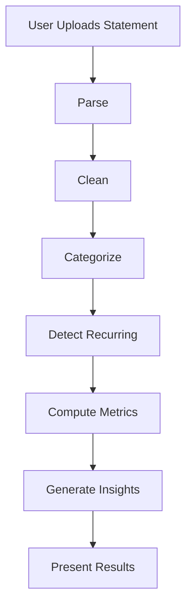
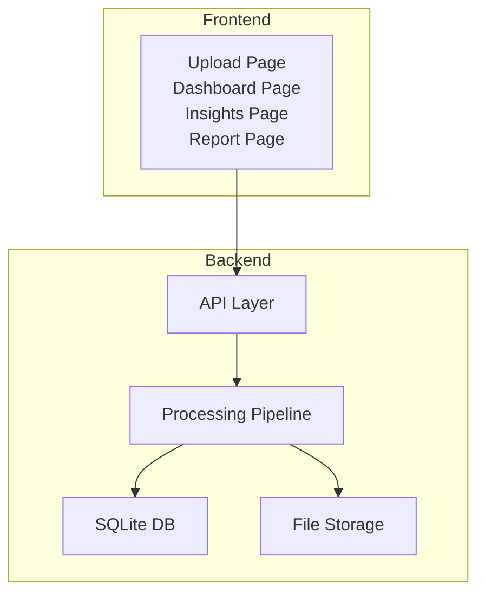
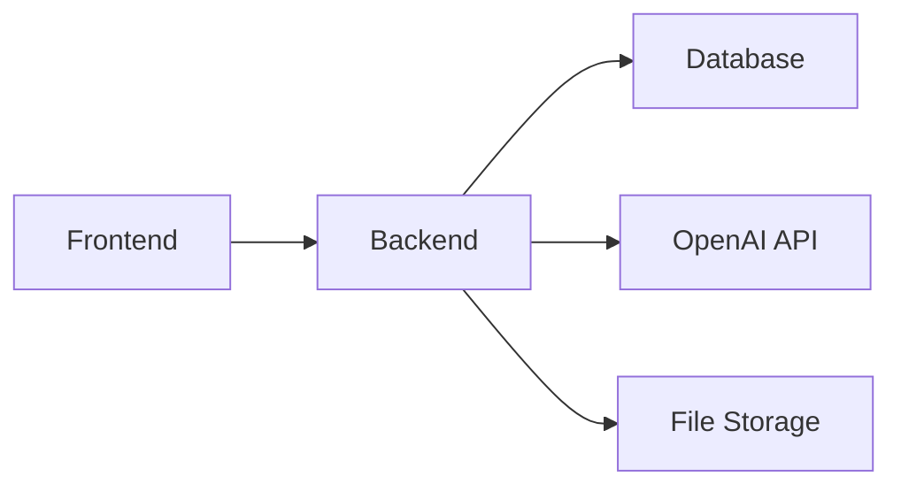

# Evaluation Criteria

<cite>
**Referenced Files in This Document**
- [context.md](file://context.md)
- [problemStatement.txt](file://problemStatement.txt)
- [architecture.md](file://architecture.md)
</cite>

## Table of Contents
1. [Introduction](#introduction)
2. [Project Structure](#project-structure)
3. [Core Components](#core-components)
4. [Architecture Overview](#architecture-overview)
5. [Detailed Component Analysis](#detailed-component-analysis)
6. [Dependency Analysis](#dependency-analysis)
7. [Performance Considerations](#performance-considerations)
8. [Troubleshooting Guide](#troubleshooting-guide)
9. [Conclusion](#conclusion)
10. [Appendices](#appendices)

## Introduction
This document defines the evaluation criteria for the RupeeRadar project. It translates the six key evaluation dimensions—Accuracy of transaction cleaning and categorization, Quality of financial insights, Ability to handle real-world messy transaction descriptions, Simplicity and usefulness of the user experience, Completeness of the end-to-end workflow, and Privacy-conscious handling of sensitive financial data—into measurable rubrics, success thresholds, and assessment methodologies. These criteria are grounded in the project’s documented goals, architecture, and deliverables.

## Project Structure
RupeeRadar is an end-to-end personal finance assistant that accepts bank statement data, cleans and normalizes transactions, categorizes them, detects recurring payments, computes financial metrics, generates insights, and presents results through a simple UI or downloadable report. The evaluation criteria are aligned with the documented core requirements and expected deliverables.

**Diagram sources**
- [architecture.md:190-240](file://architecture.md#L190-L240)

**Section sources**
- [context.md:21-42](file://context.md#L21-L42)
- [problemStatement.txt:15-31](file://problemStatement.txt#L15-L31)

## Core Components
The evaluation criteria are designed around the six pillars below. Each criterion includes:
- Definition and rationale
- Scoring rubric (excellent, good, fair, poor)
- Success thresholds (pass/fail)
- Assessment methodology (checklist, scoring scale, examples)
- Acceptable vs. unacceptable performance examples
- Measurement approach during evaluation

### Criterion 1: Accuracy of Transaction Cleaning and Categorization
- Definition: The correctness and completeness of extracting, normalizing, and assigning categories to transactions.
- Rationale: High accuracy ensures reliable downstream metrics, insights, and user trust.
- Scoring rubric:
  - Excellent: >90% of categorized transactions match expected categories; minimal duplicates; robust date/amount normalization.
  - Good: 80–90% categorized correctly; minor duplicates; mostly accurate normalization.
  - Fair: 70–80% categorized correctly; moderate duplicates; some normalization errors.
  - Poor: <70% categorized correctly; significant duplicates; frequent normalization failures.
- Success threshold: Minimum 70% categorized correctly; duplicates reduced to negligible levels; normalization errors under 5%.
- Assessment methodology:
  - Use a labeled test dataset with known categories and expected outcomes.
  - Measure precision/recall per category and overall macro-averaged accuracy.
  - Count duplicate removal effectiveness and normalization error rates.
- Acceptable performance examples:
  - Rule-based coverage of common keywords plus AI augmentation achieving >85% accuracy.
  - Deduplication removing 95%+ of near-duplicates; date parsing errors under 3%.
- Unacceptable performance examples:
  - Rule-only baseline below 60% accuracy; high duplication; frequent misclassification of debits/credits.
- Measurement approach:
  - Run backend tests against curated datasets; compute accuracy metrics; review logs for normalization anomalies.

**Section sources**
- [architecture.md:440-452](file://architecture.md#L440-L452)
- [architecture.md:453-466](file://architecture.md#L453-L466)
- [architecture.md:575-581](file://architecture.md#L575-L581)

### Criterion 2: Quality of Financial Insights
- Definition: The clarity, specificity, and actionability of AI-generated insights derived from processed transactions and metrics.
- Rationale: Insights must reference actual amounts and categories, be personalized, and suggest concrete actions.
- Scoring rubric:
  - Excellent: 4–5 specific, actionable insights; references exact amounts; tailored to user’s spending; logical severity assignment.
  - Good: 3–4 targeted insights; mostly specific; minor generic advice tolerated.
  - Fair: 2–3 insights; some generic; lacks exact amount references; unclear severity.
  - Poor: <2 insights; mostly generic; no amount references; irrelevant severity.
- Success threshold: Minimum 3 personalized insights; each references a specific amount and category; severity appropriate.
- Assessment methodology:
  - Evaluate a sample of generated insights against predefined quality criteria.
  - Check presence of exact amounts, categories, and suggested actions.
  - Verify severity alignment with spending patterns.
- Acceptable performance examples:
  - “You spend X% of income on Food — that’s ₹Y/month; consider meal prepping.”
  - “Your biggest expense is Rent at ₹Z/month; review for potential negotiation.”
- Unacceptable performance examples:
  - Generic advice like “eat healthy” without amount references.
  - Severity mismatch (e.g., info for high recurring costs).
- Measurement approach:
  - Review backend insight generation tests and sample outputs; validate prompt adherence and output quality.

**Section sources**
- [architecture.md:468-483](file://architecture.md#L468-L483)
- [architecture.md:575-581](file://architecture.md#L575-L581)

### Criterion 3: Ability to Handle Real-World Messy Transaction Descriptions
- Definition: Robustness in parsing, cleaning, and categorizing diverse, noisy, and inconsistent transaction descriptions.
- Rationale: Real-world descriptions often include codes, IDs, abbreviations, and mixed languages.
- Scoring rubric:
  - Excellent: Handles 95%+ of real-world descriptions; minimal manual intervention; low ambiguity.
  - Good: Handles 85–95%; occasional ambiguity; manageable manual corrections.
  - Fair: Handles 70–85%; frequent ambiguity; moderate manual corrections.
  - Poor: <70%; high ambiguity; excessive manual corrections.
- Success threshold: Minimum 70% handled without manual intervention; ambiguity resolved via rules/AI; low false positives/negatives.
- Assessment methodology:
  - Test with a diverse set of real-world descriptions (UPI, EMI, retail, international, etc.).
  - Measure rule coverage vs. AI fallback; track ambiguity and resolution rates.
- Acceptable performance examples:
  - Rule-based matching for common tokens; AI resolves remaining with high confidence.
  - Minimal stripping/remnants of PII; consistent merchant normalization.
- Unacceptable performance examples:
  - Frequent misclassifications due to ambiguous descriptions; high reliance on manual fixes.
- Measurement approach:
  - Backend tests covering text cleaning and categorization; inspect logs for repeated ambiguities.

**Section sources**
- [architecture.md:440-452](file://architecture.md#L440-L452)
- [architecture.md:198-217](file://architecture.md#L198-L217)
- [architecture.md:575-581](file://architecture.md#L575-L581)

### Criterion 4: Simplicity and Usefulness of the User Experience
- Definition: Clarity, ease-of-use, and practical value of the frontend experience from upload to insights and report.
- Rationale: A simple UX ensures users can quickly derive value without friction.
- Scoring rubric:
  - Excellent: Intuitive upload; immediate feedback; clear navigation; fast loading; helpful visuals; seamless report download.
  - Good: Mostly intuitive; minor friction points; adequate feedback; generally fast.
  - Fair: Some confusion; slower load times; unclear navigation; partial feedback.
  - Poor: Confusing flow; slow performance; no feedback; difficult to navigate.
- Success threshold: Upload completes within 10 seconds; dashboard renders in under 3 seconds; clear status indicators; report downloads reliably.
- Assessment methodology:
  - Walkthrough the upload → dashboard → insights → report flow; measure time-to-insight and usability.
  - Check responsiveness, error messaging, and accessibility.
- Acceptable performance examples:
  - Drag-and-drop upload; progress indicator; instant category breakdown; one-click PDF download.
  - Clear status messages and error hints.
- Unacceptable performance examples:
  - Long upload times; blank dashboards; no feedback; broken download links.
- Measurement approach:
  - Manual walkthroughs and frontend tests; monitor performance metrics and error logs.

**Section sources**
- [architecture.md:362-403](file://architecture.md#L362-L403)
- [architecture.md:583-587](file://architecture.md#L583-L587)

### Criterion 5: Completeness of the End-to-End Workflow
- Definition: The extent to which the full pipeline—from upload to final report—is functional and integrated.
- Rationale: A complete workflow demonstrates readiness and reliability.
- Scoring rubric:
  - Excellent: All endpoints functional; seamless pipeline; robust error handling; consistent data flow.
  - Good: Mostly functional; minor gaps; acceptable error handling.
  - Fair: Partially functional; noticeable gaps; inconsistent behavior.
  - Poor: Major gaps; frequent failures; no pipeline integration.
- Success threshold: All endpoints reachable; upload triggers processing; data persists; insights and reports available; errors logged and surfaced appropriately.
- Assessment methodology:
  - Execute end-to-end tests: upload → parse → clean → categorize → recurring → metrics → insights → report.
  - Validate database persistence and API responses.
- Acceptable performance examples:
  - Upload → dashboard → insights → report with zero downtime; consistent pagination and filtering.
- Unacceptable performance examples:
  - Upload fails; processing halts mid-way; missing insights or report.
- Measurement approach:
  - Backend API tests and integration tests; database checks; pipeline orchestration verification.

**Section sources**
- [architecture.md:190-240](file://architecture.md#L190-L240)
- [architecture.md:409-438](file://architecture.md#L409-L438)
- [architecture.md:575-581](file://architecture.md#L575-L581)

### Criterion 6: Privacy-Conscious Handling of Sensitive Financial Data
- Definition: Protection of user privacy by avoiding retention of raw data, minimizing data exposure, and scrubbing PII before AI processing.
- Rationale: Trust and compliance require strong privacy safeguards.
- Scoring rubric:
  - Excellent: No raw files retained; strict PII scrubbing; local-only storage; minimal data exposure; clear policies.
  - Good: Minimal raw retention; PII scrubbing implemented; mostly local storage; acceptable exposure.
  - Fair: Some raw retention; partial scrubbing; mixed storage; moderate exposure risk.
  - Poor: Raw files retained; inadequate scrubbing; cloud storage; high exposure risk.
- Success threshold: Raw statements deleted post-processing; no PII sent to AI; SQLite stored locally; no user accounts or persistent sessions.
- Assessment methodology:
  - Review data handling policies and implementation details.
  - Inspect logs for PII leakage; verify deletion routines; confirm environment configuration.
- Acceptable performance examples:
  - Files deleted after parsing; only descriptions sent to AI; SQLite stored locally; no user authentication.
- Unacceptable performance examples:
  - Raw CSV/PDF saved; account numbers or names sent to AI; cloud storage enabled.
- Measurement approach:
  - Audit backend data handling and environment configuration; review logs and deletion scripts.

**Section sources**
- [architecture.md:486-506](file://architecture.md#L486-L506)
- [context.md:43-50](file://context.md#L43-L50)

## Architecture Overview
The evaluation criteria align with the documented system architecture and processing pipeline. The frontend and backend are designed to support robust evaluation across all six dimensions.

**Diagram sources**
- [architecture.md:3-48](file://architecture.md#L3-L48)
- [architecture.md:125-185](file://architecture.md#L125-L185)

## Detailed Component Analysis
This section maps each evaluation criterion to specific components and implementation details in the architecture.

### Accuracy of Transaction Cleaning and Categorization
- Components involved: Parser, Cleaner, Categorizer, Recurring Detector, Metrics Calculator.
- Evidence in architecture:
  - Hybrid categorization strategy combining rule-based and AI.
  - Deduplication and normalization steps.
  - Recurring detection algorithm with tolerance thresholds.
- Assessment anchors:
  - Rule coverage and AI fallback effectiveness.
  - Deduplication and normalization accuracy.
  - Recurring detection consistency.

**Section sources**
- [architecture.md:198-233](file://architecture.md#L198-L233)
- [architecture.md:440-466](file://architecture.md#L440-L466)

### Quality of Financial Insights
- Components involved: Insight Generator, Metrics Calculator, Prompt Strategy.
- Evidence in architecture:
  - Structured payload to AI with metrics and categories.
  - Severity assignment and actionability requirements.
- Assessment anchors:
  - Specificity and amount references.
  - Severity alignment and actionable suggestions.

**Section sources**
- [architecture.md:468-483](file://architecture.md#L468-L483)

### Ability to Handle Real-World Messy Transaction Descriptions
- Components involved: Text cleaning utilities, rule-based keyword mapping, AI categorization.
- Evidence in architecture:
  - Rule-based keyword mapping and pattern matching.
  - AI categorization with caching and confidence scoring.
- Assessment anchors:
  - Coverage of common tokens and patterns.
  - AI fallback effectiveness and cache utilization.

**Section sources**
- [architecture.md:440-452](file://architecture.md#L440-L452)

### Simplicity and Usefulness of the User Experience
- Components involved: React frontend pages, state management, charts, and report generation.
- Evidence in architecture:
  - Route-based pages and component hierarchy.
  - Zustand store for state management.
  - Chart libraries and PDF report generation.
- Assessment anchors:
  - Navigation flow and rendering performance.
  - Report availability and download reliability.

**Section sources**
- [architecture.md:362-403](file://architecture.md#L362-L403)

### Completeness of the End-to-End Workflow
- Components involved: Upload endpoint, processing pipeline, database persistence, API endpoints.
- Evidence in architecture:
  - Orchestration of the full pipeline.
  - API endpoints for transactions, categories, recurring, metrics, insights, and report.
  - Database schema for statements, transactions, and insights.
- Assessment anchors:
  - End-to-end API tests and pipeline execution.
  - Database persistence and response consistency.

**Section sources**
- [architecture.md:409-438](file://architecture.md#L409-L438)
- [architecture.md:242-316](file://architecture.md#L242-L316)
- [architecture.md:319-359](file://architecture.md#L319-L359)

### Privacy-Conscious Handling of Sensitive Financial Data
- Components involved: Data handling policies, PII scrubbing, local storage, environment configuration.
- Evidence in architecture:
  - No persistent raw data policy.
  - PII scrubbing before AI calls.
  - Local-only storage and minimal AI payload.
- Assessment anchors:
  - Deletion routines and environment variables.
  - Log inspection for PII leakage.

**Section sources**
- [architecture.md:486-506](file://architecture.md#L486-L506)

## Dependency Analysis
The evaluation criteria depend on cohesive integration across frontend, backend, and data handling components. Dependencies include:
- Frontend relies on backend APIs for data.
- Backend depends on parsers, cleaners, categorizers, and AI services.
- Data integrity depends on database schema and file storage policies.

**Diagram sources**
- [architecture.md:3-48](file://architecture.md#L3-L48)
- [architecture.md:125-185](file://architecture.md#L125-L185)

**Section sources**
- [architecture.md:3-48](file://architecture.md#L3-L48)

## Performance Considerations
While not a direct evaluation dimension, performance impacts user experience and workflow completeness. Mitigations include batching AI calls, pagination, and caching.

- Large statements: paginated API responses and streaming PDF report.
- AI latency: batch processing with progress indication.
- Costs: rule-first pass reduces AI calls to ~30–40%.
- Rendering: memoized charts and lazy-loaded pages.

**Section sources**
- [architecture.md:590-599](file://architecture.md#L590-L599)

## Troubleshooting Guide
Common issues and their impact on evaluation:
- Unsupported file format: 400 response with supported formats list.
- Corrupted/unreadable file: 422 with parsing error details.
- OpenAI API failure: fall back to rule-only; log error.
- Rate limits: batch with delays; retry with exponential backoff.
- Empty statement: return 200 with empty results; warn user.
- Database write failure: rollback; mark statement as failed.
- Missing fields: skip row with warning; continue processing.

**Section sources**
- [architecture.md:559-570](file://architecture.md#L559-L570)

## Conclusion
The six evaluation criteria provide a comprehensive framework to assess RupeeRadar’s capability to transform messy financial data into accurate, insightful, and privacy-safe personal finance summaries. By aligning each criterion with specific components and implementation details in the architecture, evaluators can consistently measure performance, identify gaps, and guide improvements toward a production-ready prototype.

## Appendices
- Acceptable vs. unacceptable examples are provided within each criterion for quick reference during evaluation.
- Assessment methodologies include quantitative measures (accuracy, thresholds) and qualitative checks (specificity, clarity, usability).
- Measurement approaches leverage backend tests, frontend tests, and environment audits.