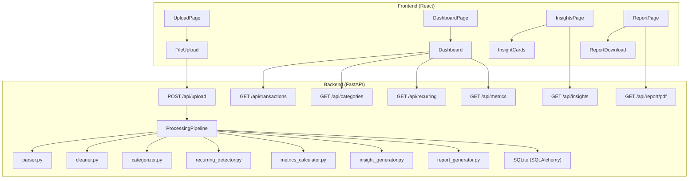
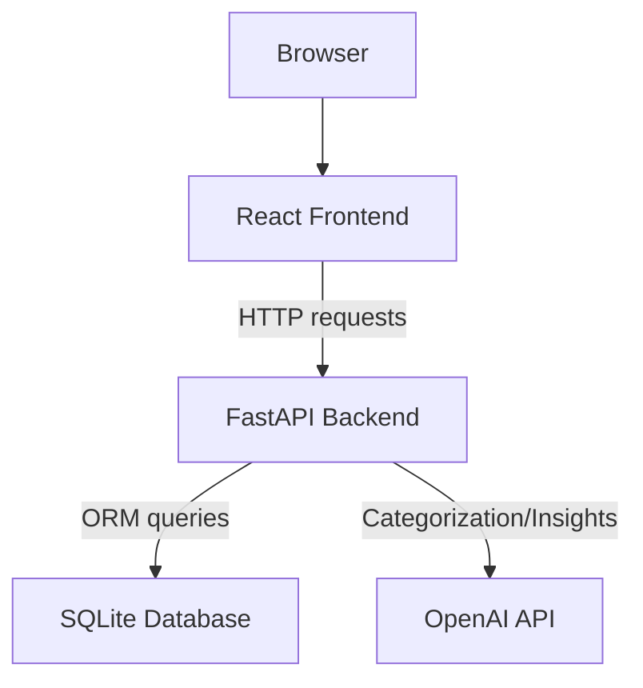
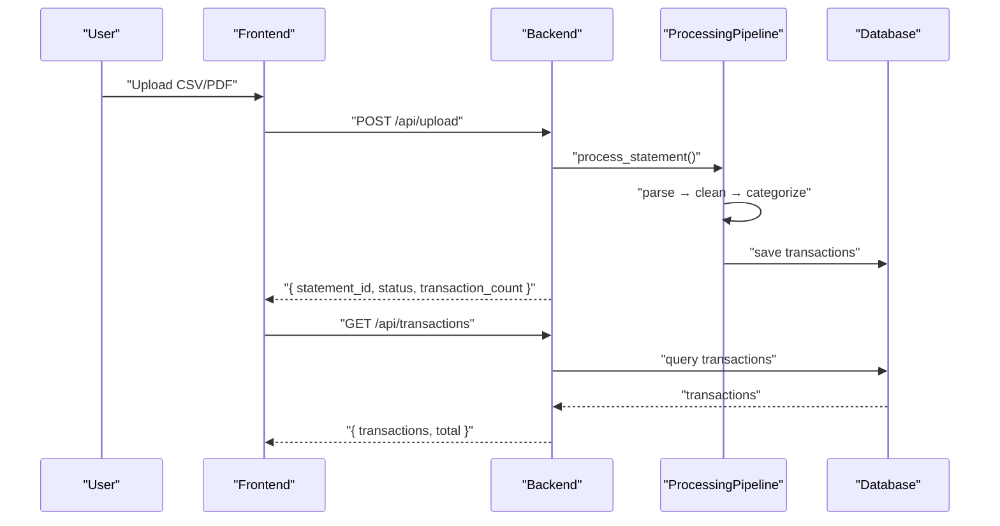
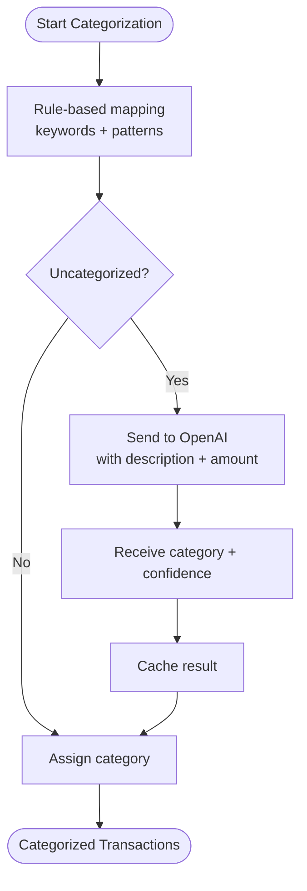
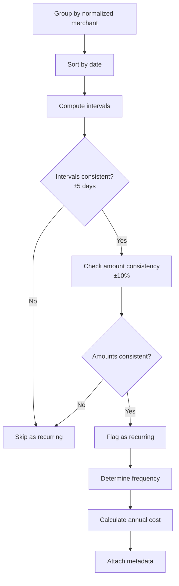
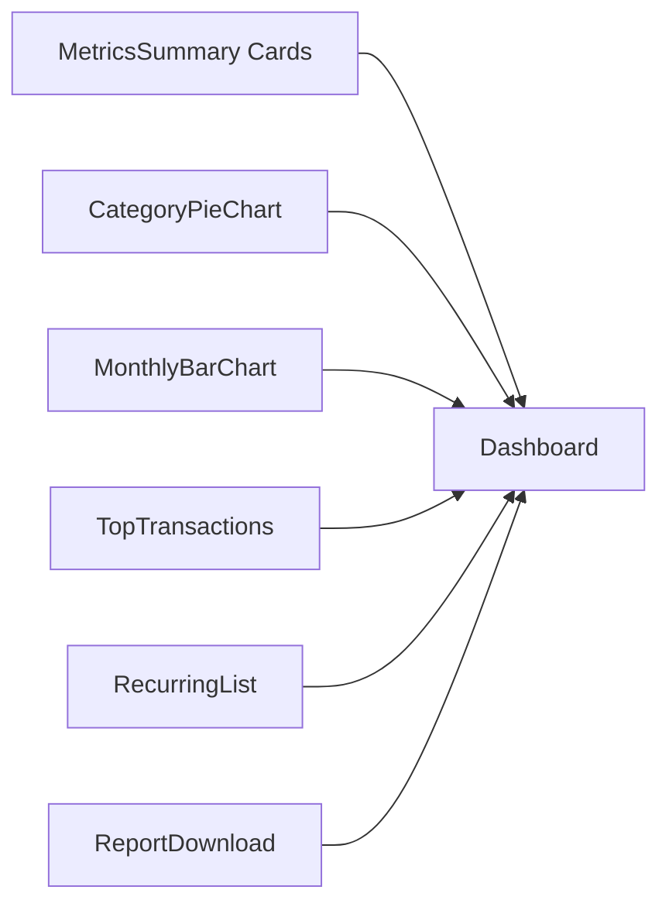
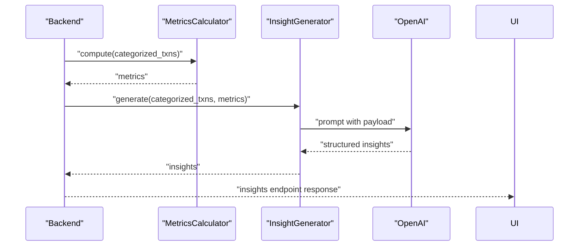
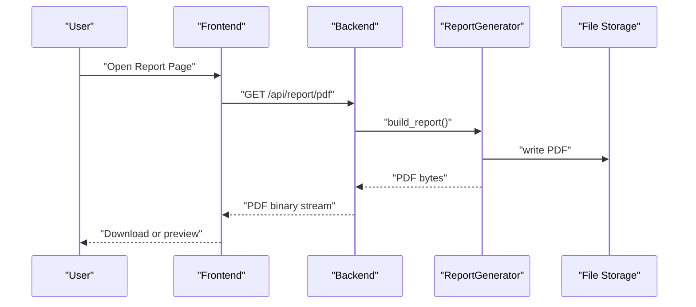
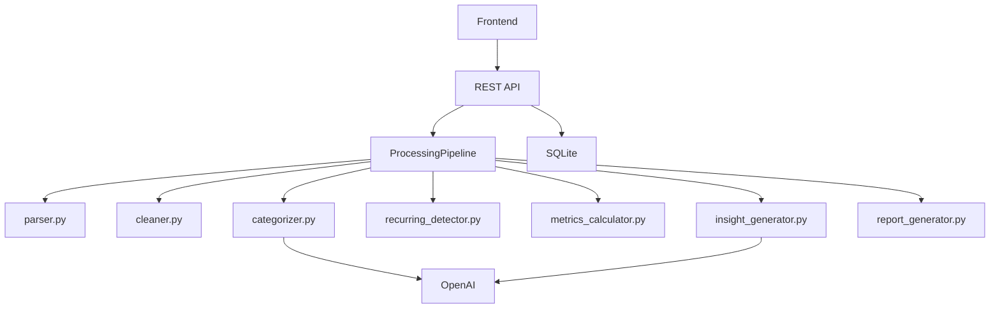

# Expected Deliverables

<cite>
**Referenced Files in This Document**
- [context.md](file://context.md)
- [problemStatement.txt](file://problemStatement.txt)
- [architecture.md](file://architecture.md)
</cite>

## Table of Contents
1. [Introduction](#introduction)
2. [Project Structure](#project-structure)
3. [Core Components](#core-components)
4. [Architecture Overview](#architecture-overview)
5. [Detailed Component Analysis](#detailed-component-analysis)
6. [Dependency Analysis](#dependency-analysis)
7. [Performance Considerations](#performance-considerations)
8. [Troubleshooting Guide](#troubleshooting-guide)
9. [Conclusion](#conclusion)
10. [Appendices](#appendices)

## Introduction
This document defines the working prototype deliverables for RupeeRadar, an AI-powered personal finance assistant. It specifies the technical requirements, quality expectations, validation criteria, and user-facing outcomes for each deliverable. The goal is to transform raw bank statement data into a clear, actionable personal finance summary that answers key spending questions and supports informed financial decisions.

## Project Structure
The prototype is a full-stack application with a React frontend and a Python FastAPI backend. The backend orchestrates the end-to-end processing pipeline: parse, clean, categorize, detect recurring payments, compute financial metrics, and generate insights. The frontend presents results through a dashboard and a downloadable report.

**Diagram sources**
- [architecture.md](file://architecture.md)
- [context.md](file://context.md)

**Section sources**
- [architecture.md](file://architecture.md)
- [context.md](file://context.md)

## Core Components
This section outlines the deliverables and their technical specifications, quality expectations, and validation criteria.

- Cleaned transaction data
  - Technical specification
    - Parse CSV/PDF statements into normalized rows with date, description, amount, and type.
    - Normalize dates to ISO 8601, amounts to signed floats, and descriptions by removing noise.
    - Deduplicate entries and drop rows with missing critical fields.
    - Persist cleaned transactions linked to a statement session.
  - Quality expectations
    - High fidelity to original intent of transactions.
    - Consistent formatting and accurate signs for debits and credits.
    - Minimal missing or malformed rows.
  - Validation criteria
    - API endpoint returns a list of cleaned transactions with required fields.
    - UI displays a sortable, filterable table of transactions.
    - Example output shape: see Transaction schema.
  - User-facing features
    - Filter by category, paginate results, and export filtered subset.
  - Section sources
    - [architecture.md](file://architecture.md)
    - [context.md](file://context.md)

- Categorized expenses
  - Technical specification
    - Hybrid categorization: rule-based first pass using keyword mappings and patterns; AI second pass for uncategorized items.
    - Assign category labels from the predefined set and optionally attach confidence scores.
  - Quality expectations
    - High coverage for common Indian merchant patterns; accurate assignment for ambiguous descriptions.
  - Validation criteria
    - API endpoint returns category breakdown with totals and percentages.
    - Dashboard renders a pie chart of spending by category.
    - Example output shape: see MetricsResponse categories.
  - User-facing features
    - Drill-down by category, hover tooltips with amounts, and category-specific filters.
  - Section sources
    - [architecture.md](file://architecture.md)
    - [context.md](file://context.md)

- Recurring payment detection
  - Technical specification
    - Group transactions by normalized merchant name; analyze date intervals and amount consistency to infer frequency.
    - Cross-reference with known recurring merchants; calculate annual projected cost.
  - Quality expectations
    - Accurate monthly/quarterly/annual classification with tolerance thresholds.
  - Validation criteria
    - API endpoint returns recurring items with merchant, amount, frequency, occurrences, next expected date, and annual cost.
    - Dashboard lists recurring payments with actionable summaries.
    - Example output shape: see RecurringItem schema.
  - User-facing features
    - Toggle recurring-only views, sort by annual cost, and export recurring list.
  - Section sources
    - [architecture.md](file://architecture.md)
    - [context.md](file://context.md)

- Spend summary dashboard
  - Technical specification
    - Metrics summary cards for total income, total spend, savings, and savings rate.
    - Visualizations: category distribution pie chart, monthly income vs spend bars, top transactions table, recurring payments list.
  - Quality expectations
    - Real-time updates after processing completes; responsive and accessible UI.
  - Validation criteria
    - All charts render with correct data; pagination and filtering work as expected.
    - Metrics align with computed financial metrics.
  - User-facing features
    - Navigation between upload, dashboard, insights, and report pages; print-friendly layouts.
  - Section sources
    - [architecture.md](file://architecture.md)
    - [context.md](file://context.md)

- Personalized financial insights
  - Technical specification
    - AI generates 3–5 tailored insights referencing actual amounts and categories; severity levels included.
  - Quality expectations
    - Actionable, non-generic advice grounded in user’s spending behavior.
  - Validation criteria
    - API endpoint returns structured insights with title, description, severity, and referenced amounts.
    - Dashboard displays insights as cards with severity indicators.
  - User-facing features
    - Filter insights by severity, copy to clipboard, and share highlights.
  - Section sources
    - [architecture.md](file://architecture.md)
    - [context.md](file://context.md)

- Final report or visual summary for sharing
  - Technical specification
    - PDF report generation with financial summaries, charts, and insights; downloadable from the report page.
  - Quality expectations
    - Professional layout, complete data representation, and consistent formatting.
  - Validation criteria
    - API endpoint streams a valid PDF; report page previews and downloads the file.
  - User-facing features
    - One-click PDF download; shareable snapshot of the current session.
  - Section sources
    - [architecture.md](file://architecture.md)
    - [context.md](file://context.md)

## Architecture Overview
The prototype implements a client-server architecture with a React SPA frontend and a Python FastAPI backend. The backend encapsulates the processing pipeline and exposes REST endpoints for UI consumption.

**Diagram sources**
- [architecture.md](file://architecture.md)

**Section sources**
- [architecture.md](file://architecture.md)

## Detailed Component Analysis

### Cleaned Transaction Data Output
- Functional requirements
  - Accept CSV/PDF uploads; parse raw rows; normalize and deduplicate; persist per session.
- Data model
  - Transaction fields include identifiers, normalized date, cleaned and original descriptions, signed amount, category, recurring flags, and optional confidence.
- UI integration
  - Dashboard page consumes the transactions endpoint; supports pagination and category filtering.
- Validation
  - API returns a list with total count; frontend renders a table with sortable columns.

**Diagram sources**
- [architecture.md](file://architecture.md)

**Section sources**
- [architecture.md](file://architecture.md)
- [context.md](file://context.md)

### Categorized Expense Reports
- Functional requirements
  - Rule-based categorization plus AI augmentation; cache AI results to reduce costs.
- Visualization
  - Dashboard pie chart shows category totals and percentages.
- Validation
  - API returns category breakdown aligned with transaction totals.

**Diagram sources**
- [architecture.md](file://architecture.md)

**Section sources**
- [architecture.md](file://architecture.md)
- [context.md](file://context.md)

### Recurring Payment Detection Results
- Functional requirements
  - Group by normalized merchant; compute interval consistency and amount stability; cross-reference known merchants.
- Output
  - Frequency, next expected date, occurrences, and annual projected cost.
- Validation
  - API returns recurring items; dashboard lists recurring payments.

**Diagram sources**
- [architecture.md](file://architecture.md)

**Section sources**
- [architecture.md](file://architecture.md)
- [context.md](file://context.md)

### Spend Summary Dashboard Functionality
- Functional requirements
  - Metrics summary cards, category pie chart, monthly bars, top transactions, recurring list, and PDF download trigger.
- Validation
  - All charts reflect backend computations; navigation between pages works seamlessly.

**Diagram sources**
- [architecture.md](file://architecture.md)

**Section sources**
- [architecture.md](file://architecture.md)
- [context.md](file://context.md)

### Personalized Financial Insights
- Functional requirements
  - Send computed metrics and categorized data to AI; return 3–5 insights with severity and referenced amounts.
- Validation
  - API returns structured insights; UI renders cards with severity indicators.

**Diagram sources**
- [architecture.md](file://architecture.md)

**Section sources**
- [architecture.md](file://architecture.md)
- [context.md](file://context.md)

### Final Report or Visual Summary for Sharing
- Functional requirements
  - Generate a PDF report with financial summaries, charts, and insights; serve as a downloadable artifact.
- Validation
  - API streams a valid PDF; report page previews and downloads the file.

**Diagram sources**
- [architecture.md](file://architecture.md)

**Section sources**
- [architecture.md](file://architecture.md)
- [context.md](file://context.md)

## Dependency Analysis
- Internal dependencies
  - Frontend depends on backend endpoints for data and state.
  - Backend orchestrates services in a strict pipeline order.
- External dependencies
  - OpenAI API for AI-driven categorization and insights.
  - SQLite for local persistence; pdfplumber/csv for parsing.
- Coupling and cohesion
  - Services are cohesive around a single responsibility; low coupling via well-defined schemas and endpoints.

**Diagram sources**
- [architecture.md](file://architecture.md)

**Section sources**
- [architecture.md](file://architecture.md)

## Performance Considerations
- Backend
  - Batch uncategorized items for AI calls; cache AI results; paginate API responses.
- Frontend
  - Memoized charts and lazy-loaded pages improve responsiveness.
- PDF generation
  - Pre-generate and cache reports to minimize latency.

[No sources needed since this section provides general guidance]

## Troubleshooting Guide
- Common scenarios and handling
  - Unsupported file format: return 400 with supported formats.
  - Corrupted/unreadable file: return 422 with parsing error details.
  - OpenAI API failure: fall back to rule-only categorization; log errors.
  - Rate limits: batch with delays and retry with exponential backoff.
  - Empty statements: return 200 with empty results; notify user.
  - Database write failures: rollback and mark statement as failed.
  - Missing fields: skip row with warnings; continue processing.

**Section sources**
- [architecture.md](file://architecture.md)

## Conclusion
The working prototype delivers a complete, privacy-conscious personal finance workflow: accept raw statements, clean and categorize transactions, detect recurring payments, compute meaningful metrics, generate personalized insights, and present results through a dashboard and downloadable report. The technical specifications, quality expectations, and validation criteria outlined here ensure a robust, user-focused solution ready for demonstration.

## Appendices
- Example output shapes
  - Transaction: see Transaction schema.
  - MetricsResponse: see MetricsResponse schema.
  - RecurringItem: see RecurringItem schema.
  - Insight: see Insight schema.

**Section sources**
- [architecture.md](file://architecture.md)
- [context.md](file://context.md)