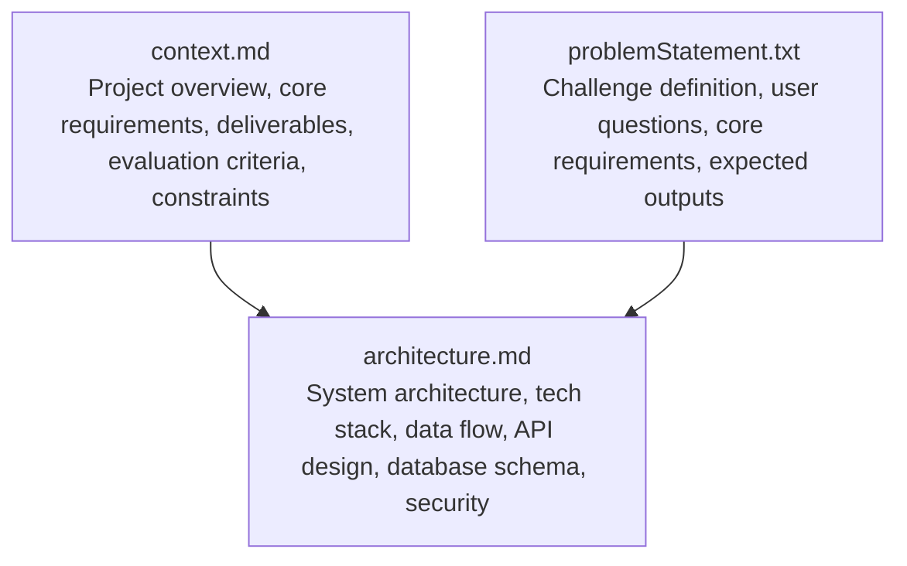
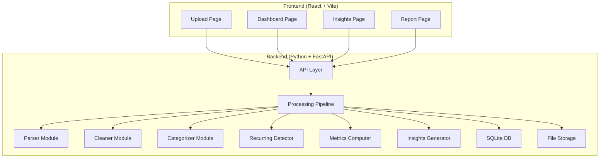
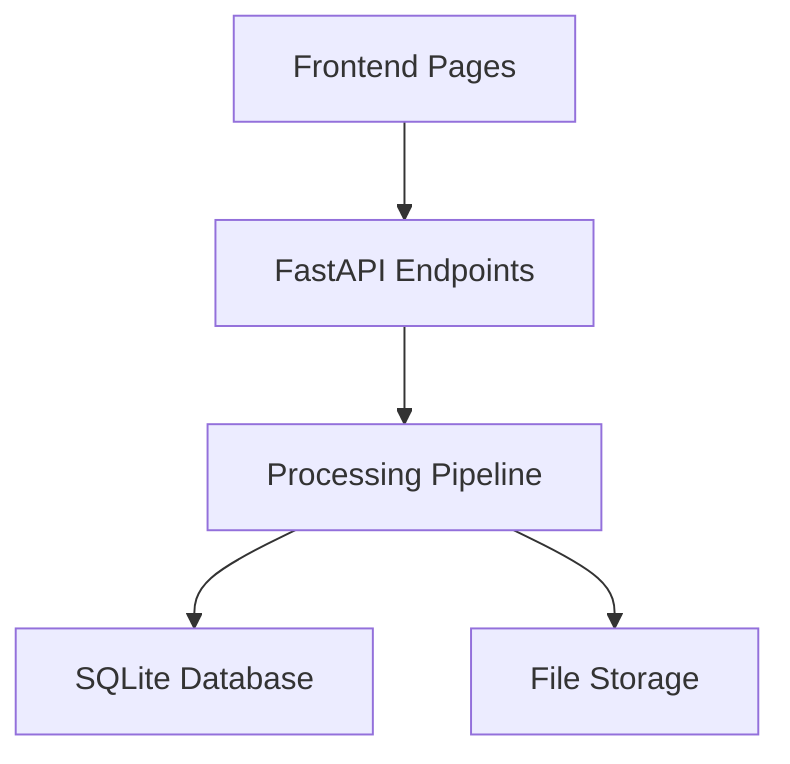

# Requirements Specification

<cite>
**Referenced Files in This Document**
- [context.md](file://context.md)
- [problemStatement.txt](file://problemStatement.txt)
- [architecture.md](file://architecture.md)
</cite>

## Table of Contents
1. [Introduction](#introduction)
2. [Project Structure](#project-structure)
3. [Core Requirements](#core-requirements)
4. [Architecture Overview](#architecture-overview)
5. [Detailed Requirement Analysis](#detailed-requirement-analysis)
6. [Dependency Analysis](#dependency-analysis)
7. [Performance Considerations](#performance-considerations)
8. [Troubleshooting Guide](#troubleshooting-guide)
9. [Conclusion](#conclusion)
10. [Appendices](#appendices)

## Introduction
This document specifies the functional and non-functional requirements for RupeeRadar, an AI-powered personal finance assistant designed to transform messy bank statement data into actionable financial insights. The solution focuses on an end-to-end workflow that accepts raw financial data, cleans and normalizes it, categorizes transactions into ten predefined categories, detects recurring payments, computes financial metrics, generates personalized insights, and presents results through a simple UI or downloadable report.

The project emphasizes building a working prototype that prioritizes completeness of the pipeline over perfect support for every bank format, with flexibility in technology choices. Privacy-conscious handling of sensitive financial data is a core constraint, ensuring no persistent raw data is retained and that AI payloads are scrubbed of personally identifiable information (PII).

## Project Structure
The repository provides a minimal but comprehensive foundation for the requirements specification and architecture decisions. The key files define the problem statement, core requirements, expected deliverables, evaluation criteria, constraints, and the technical architecture for the prototype.

**Diagram sources**
- [context.md:1-80](file://context.md#L1-L80)
- [problemStatement.txt:1-43](file://problemStatement.txt#L1-L43)
- [architecture.md:1-611](file://architecture.md#L1-L611)

**Section sources**
- [context.md:1-80](file://context.md#L1-L80)
- [problemStatement.txt:1-43](file://problemStatement.txt#L1-L43)
- [architecture.md:73-186](file://architecture.md#L73-L186)

## Core Requirements
This section documents the seven core requirements derived from the project context and problem statement, along with implementation considerations, acceptance criteria, and success metrics.

1) **Data Input Processing**
- Functional requirement: Accept bank statement data as input.
- Implementation considerations:
  - Support CSV and PDF formats for uploaded statements.
  - Validate file types and reject unsupported formats.
  - Stream uploads to minimize memory overhead for large files.
- Acceptance criteria:
  - Successful upload endpoint responds with statement metadata.
  - Parser extracts raw transaction rows with date, description, amount, and type.
- Success metrics:
  - Upload success rate > 95% for supported formats.
  - Parsing accuracy for typical bank statement layouts.

2) **Transaction Cleaning**
- Functional requirement: Extract or clean transactions into a structured format.
- Implementation considerations:
  - Normalize dates to ISO 8601 format.
  - Convert amounts to signed floats (negative for debits, positive for credits).
  - Strip noise from descriptions (e.g., bank codes, transaction IDs).
  - Deduplicate transactions and flag/drop rows with missing critical fields.
- Acceptance criteria:
  - Cleaned dataset excludes duplicates and malformed entries.
  - Amounts and dates are consistently formatted.
- Success metrics:
  - Deduplication effectiveness > 90%.
  - Field completeness > 95%.

3) **Categorization into 10 Predefined Categories**
- Functional requirement: Categorize transactions into meaningful groups:
  - Food, Travel, Shopping, Bills, EMI, Subscriptions, Salary, Rent, Investments, Other.
- Implementation considerations:
  - Hybrid approach: rule-based first pass using keyword dictionaries and patterns; AI-powered second pass for remaining uncategorized transactions.
  - Cache AI responses to reduce repeated calls for similar descriptions.
- Acceptance criteria:
  - All transactions receive a category label from the predefined set.
  - Rule coverage targets ~60–70% of common Indian transaction descriptions.
- Success metrics:
  - Categorization accuracy > 85%.
  - AI call reduction via caching improves cost/performance.

4) **Recurring Payment Detection**
- Functional requirement: Identify recurring transactions (subscriptions, EMIs, rent, SIPs, insurance).
- Implementation considerations:
  - Group transactions by normalized merchant name.
  - Analyze date intervals for periodicity with tolerance thresholds.
  - Check amount consistency across occurrences.
  - Cross-reference known recurring merchants.
- Acceptance criteria:
  - Recurring items include merchant, amount, frequency, occurrences, next expected date, and annual cost.
- Success metrics:
  - Recurrence detection precision/recall > 80% on known recurring patterns.

5) **Financial Metrics Calculation**
- Functional requirement: Calculate total income, total spend, savings, top categories, biggest transactions.
- Implementation considerations:
  - Compute totals by summing credits and debits separately.
  - Derive savings and savings rate.
  - Rank top categories by spending totals.
  - Identify top 5 largest debit transactions.
  - Provide monthly income/spend breakdown.
- Acceptance criteria:
  - Metrics align with manual calculations on known datasets.
  - Monthly breakdown covers the statement period.
- Success metrics:
  - Metric computation accuracy > 99%.
  - Response time for metric queries under 2 seconds.

6) **Insight Generation**
- Functional requirement: Generate clear, human-readable spending insights using actual transaction amounts.
- Implementation considerations:
  - Send computed metrics and categorized data to AI with structured prompts.
  - Instruct AI to generate 3–5 specific, actionable insights referencing exact amounts.
  - Assign severity levels and suggest concrete actions.
- Acceptance criteria:
  - Insights reference actual amounts and categories.
  - Severity assignments are logical given the data.
- Success metrics:
  - Insight quality rated highly by users.
  - Consistency in actionable recommendations.

7) **Output Presentation**
- Functional requirement: Present results through a simple UI, dashboard, or downloadable report.
- Implementation considerations:
  - Dashboard displays metrics summary, category distribution, monthly trends, top transactions, recurring payments, and insights.
  - Provide PDF report download with summarized data and insights.
- Acceptance criteria:
  - Dashboard renders cleanly and is responsive.
  - PDF report includes all relevant data and is visually coherent.
- Success metrics:
  - User satisfaction with dashboard usability.
  - Report completeness and readability.

**Section sources**
- [context.md:21-56](file://context.md#L21-L56)
- [problemStatement.txt:15-31](file://problemStatement.txt#L15-L31)
- [architecture.md:190-240](file://architecture.md#L190-L240)

## Architecture Overview
The system follows a client-server architecture with a React frontend and a Python FastAPI backend. The backend orchestrates the processing pipeline, while the frontend provides an interactive dashboard and reporting capabilities.

**Diagram sources**
- [architecture.md:3-48](file://architecture.md#L3-L48)
- [architecture.md:125-186](file://architecture.md#L125-L186)

**Section sources**
- [architecture.md:3-48](file://architecture.md#L3-L48)
- [architecture.md:125-186](file://architecture.md#L125-L186)

## Detailed Requirement Analysis
This section provides in-depth analysis of each requirement, including implementation patterns, acceptance criteria, success metrics, and expected deliverables.

### Data Input Processing
- Implementation patterns:
  - File upload via REST endpoint with form-data.
  - Parser module extracts rows from CSV/PDF.
  - Validation ensures required fields exist.
- Acceptance criteria:
  - Upload endpoint returns statement metadata.
  - Parser handles common bank statement layouts.
- Success metrics:
  - Upload throughput and parsing accuracy.

**Section sources**
- [architecture.md:198-203](file://architecture.md#L198-L203)
- [architecture.md:246-254](file://architecture.md#L246-L254)

### Transaction Cleaning
- Implementation patterns:
  - Date normalization, amount parsing, description cleaning, deduplication.
  - Logging and graceful handling of missing fields.
- Acceptance criteria:
  - Cleaned dataset meets quality standards.
  - No duplicates remain post-processing.
- Success metrics:
  - Deduplication and field completeness rates.

**Section sources**
- [architecture.md:204-210](file://architecture.md#L204-L210)

### Categorization into 10 Predefined Categories
- Implementation patterns:
  - Rule-based categorization using keyword dictionaries and patterns.
  - AI categorization for remaining uncategorized transactions with caching.
- Acceptance criteria:
  - All transactions assigned to one of the ten categories.
  - Rule coverage targets met.
- Success metrics:
  - Categorization accuracy and AI call reduction.

**Section sources**
- [architecture.md:211-217](file://architecture.md#L211-L217)
- [architecture.md:440-452](file://architecture.md#L440-L452)

### Recurring Payment Detection
- Implementation patterns:
  - Group by normalized merchant name.
  - Analyze date intervals and amount consistency.
  - Cross-reference known recurring merchants.
- Acceptance criteria:
  - Recurring items include frequency, next expected date, and annual cost.
- Success metrics:
  - Precision/recall for recurrence detection.

**Section sources**
- [architecture.md:218-224](file://architecture.md#L218-L224)
- [architecture.md:453-466](file://architecture.md#L453-L466)

### Financial Metrics Calculation
- Implementation patterns:
  - Compute totals, savings, savings rate, top categories, biggest transactions, monthly breakdown.
- Acceptance criteria:
  - Metrics align with known datasets.
  - Monthly breakdown covers the statement period.
- Success metrics:
  - Accuracy and responsiveness of metric queries.

**Section sources**
- [architecture.md:225-233](file://architecture.md#L225-L233)

### Insight Generation
- Implementation patterns:
  - Structured payload sent to AI with computed metrics.
  - Prompt instructs AI to generate specific, actionable insights.
- Acceptance criteria:
  - Insights reference actual amounts and categories.
  - Severity assignments are logical.
- Success metrics:
  - Insight quality and actionability.

**Section sources**
- [architecture.md:234-239](file://architecture.md#L234-L239)
- [architecture.md:468-483](file://architecture.md#L468-L483)

### Output Presentation
- Implementation patterns:
  - Dashboard components for metrics, charts, lists, and insights.
  - PDF report generation with summarized data.
- Acceptance criteria:
  - Dashboard renders cleanly and is responsive.
  - PDF report includes all relevant data.
- Success metrics:
  - User satisfaction and report readability.

**Section sources**
- [architecture.md:362-404](file://architecture.md#L362-L404)
- [architecture.md:490-506](file://architecture.md#L490-L506)

## Dependency Analysis
The system exhibits clear separation of concerns across frontend and backend layers, with well-defined APIs and data flows. The backend orchestrates the processing pipeline, while the frontend consumes the API and renders results.

**Diagram sources**
- [architecture.md:242-255](file://architecture.md#L242-L255)
- [architecture.md:409-439](file://architecture.md#L409-L439)

**Section sources**
- [architecture.md:242-255](file://architecture.md#L242-L255)
- [architecture.md:409-439](file://architecture.md#L409-L439)

## Performance Considerations
- Large statements: Paginated API responses and streaming PDF report.
- OpenAI latency: Batch uncategorized transactions and show progress.
- Cost control: Rule-based first pass reduces AI calls to ~30–40% of total.
- Rendering speed: Memoized charts and lazy-loaded pages.
- PDF generation: Pre-generate and cache results.

**Section sources**
- [architecture.md:590-599](file://architecture.md#L590-L599)

## Troubleshooting Guide
Common scenarios and handling strategies:
- Unsupported file format: Return 400 with supported formats list.
- Corrupted/unreadable file: Return 422 with parsing error details.
- OpenAI API failure: Fall back to rule-only categorization; log error.
- OpenAI rate limit: Batch with delays; retry with exponential backoff.
- Empty statement: Return 200 with empty results; warn user.
- Database write failure: Transaction rollback; mark statement as failed.
- Missing fields: Skip row with warning log; continue processing.

**Section sources**
- [architecture.md:559-570](file://architecture.md#L559-L570)

## Conclusion
RupeeRadar’s requirements specification establishes a clear, end-to-end pipeline for transforming raw bank statement data into actionable financial insights. The hybrid categorization approach, robust recurring detection, comprehensive metrics computation, and AI-driven insights collectively address the core user questions. The architecture emphasizes simplicity, privacy-conscious handling, and a working prototype over perfect bank format support, enabling rapid iteration and deployment.

## Appendices
- Expected Deliverables:
  - Cleaned transaction data
  - Categorized expenses
  - Recurring payment detection
  - Spend summary dashboard
  - Personalized financial insights
  - Final report or visual summary

- Evaluation Criteria:
  - Accuracy of transaction cleaning and categorization
  - Quality of financial insights
  - Handling of messy descriptions
  - Simplicity and usefulness of user experience
  - Completeness of the end-to-end workflow
  - Privacy-conscious data handling

- Constraints:
  - Prioritize working prototype over perfect bank format support
  - Technology stack flexibility

**Section sources**
- [context.md:32-56](file://context.md#L32-L56)
- [problemStatement.txt:24-42](file://problemStatement.txt#L24-L42)